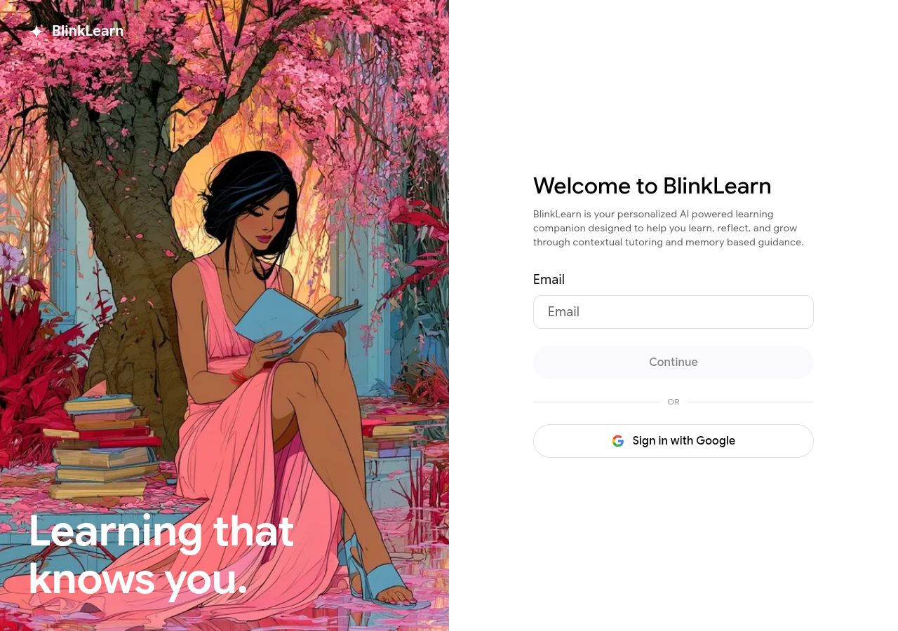

# Signing In

Go to [blinklearn.com](https://www.blinklearn.com) and click **Log in**.

## Sign-in methods

- **Email and password** — enter the email and password you registered with
- **Google** — click **Continue with Google** and select your Google account

## Shared credentials across Envisioning

If you use BlinkLife or another Envisioning product with the same email, your credentials work on BlinkLearn too. Your AI memory and learning history are shared across the Envisioning ecosystem.

## Staying signed in

BlinkLearn keeps you signed in on trusted devices. If you are signed out unexpectedly, check that cookies are enabled in your browser.

## Problems signing in?

See [Login Issues](../troubleshooting/login-issues.md) or [reset your password](password-reset.md).
