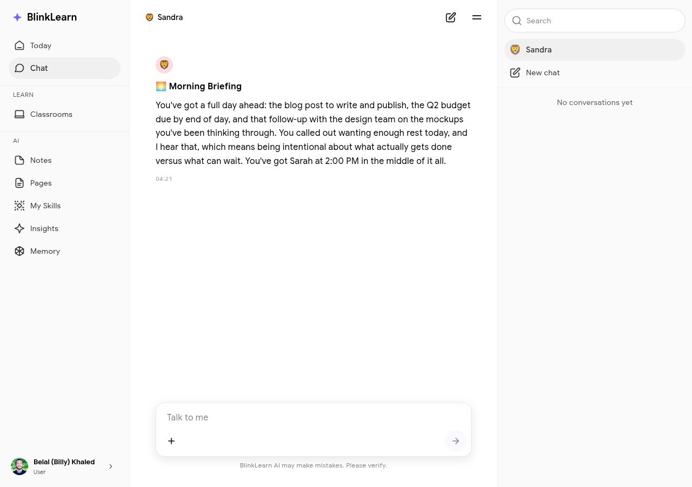

# Chat with Sandra

Sandra is your personal AI learning companion. She knows everything you've learned on BlinkLearn and can help you make sense of it, connect ideas, and go deeper on any topic.

## Starting a conversation

Go to **Chat** in the sidebar to open a conversation with Sandra. You can ask her anything:

- "What have I learned about leadership this month?"
- "Summarise the key ideas from the fasting course"
- "What meditations have I done recently?"
- "Connect what I learned in the last classroom to my goal of improving focus"

Sandra has access to your full learning history — lessons completed, notes taken, insights generated — so her answers are grounded in what you've actually studied.

## Memory-powered responses

Unlike a general AI, Sandra's responses are personalised to you. She draws from:

- **Your lessons** — content from every course and classroom you've engaged with
- **Your notes** — smart notes you've taken during sessions
- **Your insights** — AI-generated connections from your learning history
- **Your goals** — the areas you've told BlinkLearn you want to grow in

## Conversation history

Sandra remembers your previous conversations. You can refer back to earlier discussions and she'll maintain context across sessions.

## Tips for getting the most from Sandra

- Ask open-ended questions ("What patterns do you notice in what I've been learning?")
- Ask for connections ("How does what I learned in X relate to Y?")
- Ask for recommendations ("What should I study next based on my goals?")
