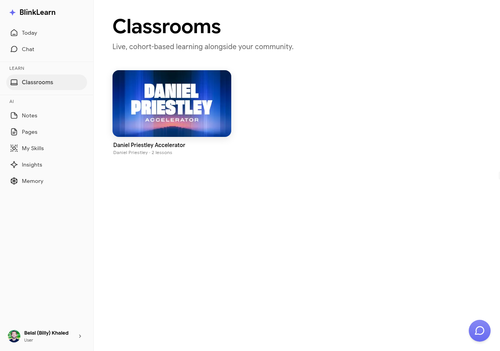

# Classrooms

Classrooms are structured learning experiences created by teachers, coaches, and experts on BlinkLearn. They combine live sessions, content, and direct access to the author.

## Types of classrooms

- **Live classrooms** — scheduled sessions you attend in real time with the author and other learners
- **Async classrooms** — self-paced content you work through on your own schedule

## Joining a classroom

When you enrol in a classroom, it appears in your Classrooms section. Your progress and any notes you take are saved and fed into Sandra's understanding of your learning.

## Classroom briefings

For active classrooms, Sandra generates briefings — summaries of what's happened in the classroom and what's coming next. These appear in your [Today](today.md) view.

## Interacting with the author

Some classrooms include Q&A or feedback features where you can interact with the teacher directly. Check the classroom detail page for what's available.
