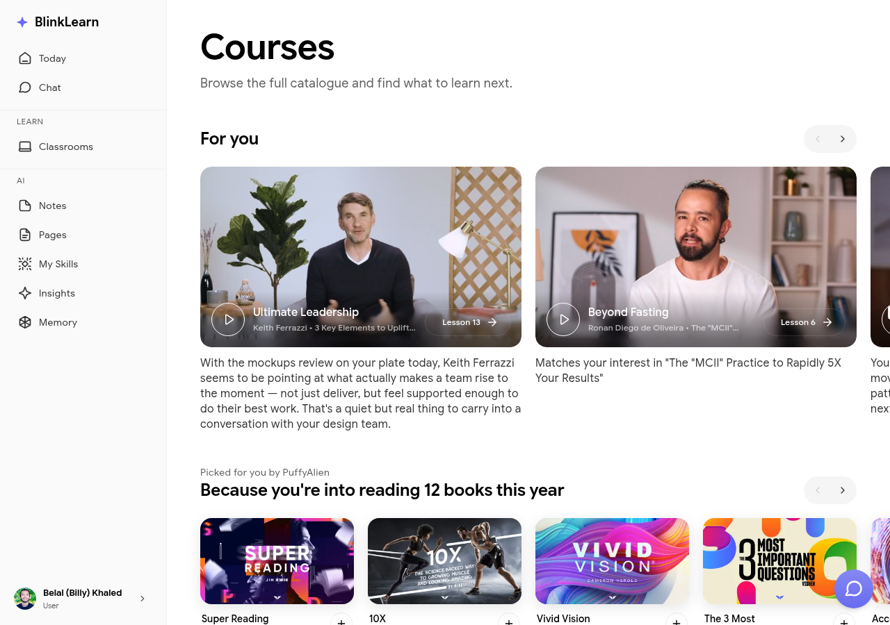

# Courses

The **Courses** section is where you access all the on-demand learning content available to you on BlinkLearn.

## Browsing courses

Go to **Courses** in the sidebar to see your enrolled courses and browse the catalog. Each course card shows the title, author, and your progress if you've started.

## Inside a course

Click a course to open it. Inside, you'll find:

- **Lessons** — individual video or text lessons you work through in sequence
- **Author information** — who created the course and their background
- **Your progress** — how far through the course you are

## Completing lessons

Click a lesson to start it. Your progress is saved automatically — you can pick up where you left off at any time. Each lesson you complete feeds into Sandra's understanding of your learning history.

## Course notes

While inside a lesson, you can take notes that are automatically linked to that lesson. Find them later in your [Notes](notes.md) or [Library](library.md).
