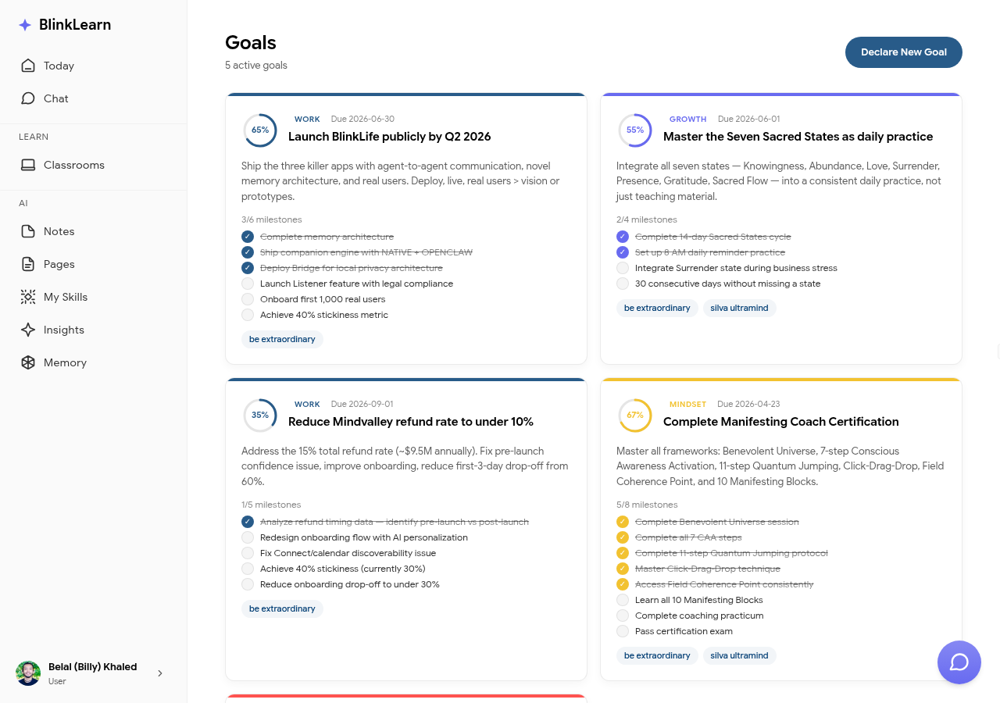

# Goals

Goals let you tell BlinkLearn what you want to achieve — and Sandra uses this to shape your daily briefing, recommendations, and insights.

## Setting a goal

Go to **Goals** in the sidebar and add a new goal. Describe what you want to learn or achieve — for example:

- "Become a better communicator"
- "Build a daily meditation habit"
- "Understand the fundamentals of leadership"

Goals can be as broad or specific as you like.

## How Sandra uses your goals

Sandra incorporates your goals into everything she does:

- Your [Today](today.md) briefing highlights learning that connects to your goals
- [Insights](insights.md) surface connections relevant to your goal areas
- [Chat](chat.md) responses are framed in terms of what you're trying to achieve

## Updating goals

Your goals evolve as you grow. Update or remove goals at any time — Sandra will adjust immediately.
