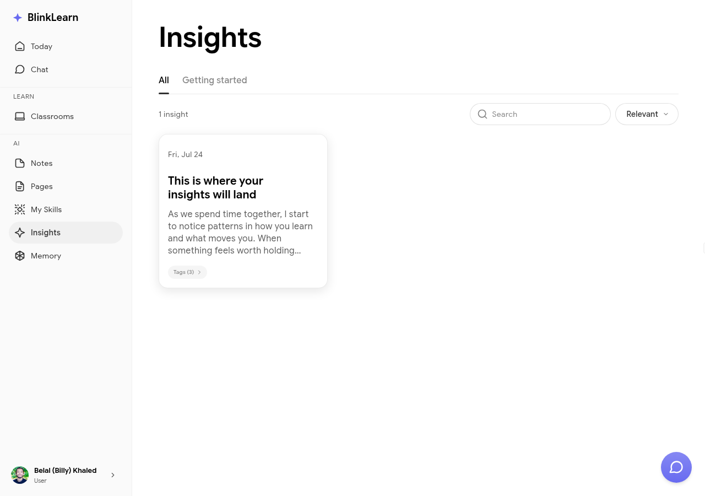

# Insights

Insights are AI-generated connections that BlinkLearn surfaces across everything you've learned — linking ideas from different courses, classrooms, and meditations that relate to each other.

## What insights are

Sandra continuously analyses your learning history and extracts patterns, recurring themes, and connections between ideas from different sources. These surface as Insights — short, actionable observations like:

- "This concept from your leadership course connects to what you explored in the fasting module"
- "Three of your recent sessions touched on the idea of intentional focus — here's a synthesis"

## Browsing your insights

Go to **Insights** in the sidebar to see all insights Sandra has generated for you. They're organised by recency and relevance.

## How insights are generated

Sandra generates insights automatically as you:

- Complete lessons and courses
- Take notes
- Chat with her about your learning

You don't need to do anything — insights appear as your learning grows.

## Using insights

Insights are a starting point for deeper exploration. Click any insight to see the connected content and jump back into the relevant lesson or note.
