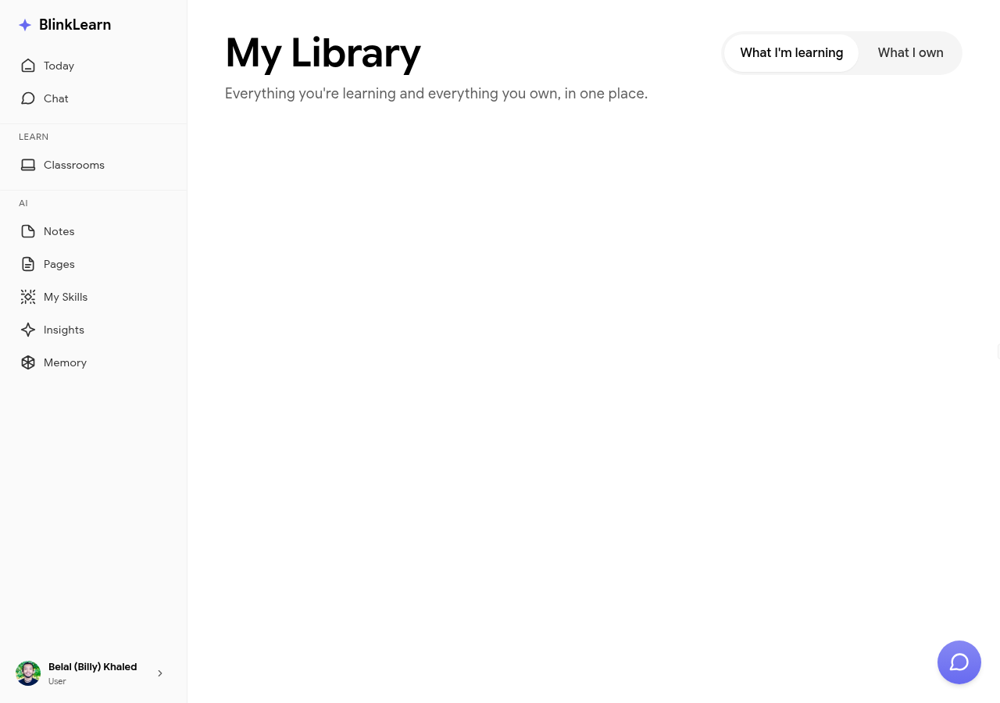

# Library

Your **Library** is your personal collection of saved content on BlinkLearn — courses, classrooms, notes, and anything else you've bookmarked or want to return to.

## What's in your Library

- Courses you're enrolled in
- Classrooms you've joined
- Notes you've created
- Content you've saved or bookmarked

## Accessing your Library

Go to **Library** in the sidebar to see all your saved content in one place. Use the filters to browse by content type.

## Continuing where you left off

Your progress on any course or classroom is saved. Open it from the Library to pick up exactly where you stopped.
