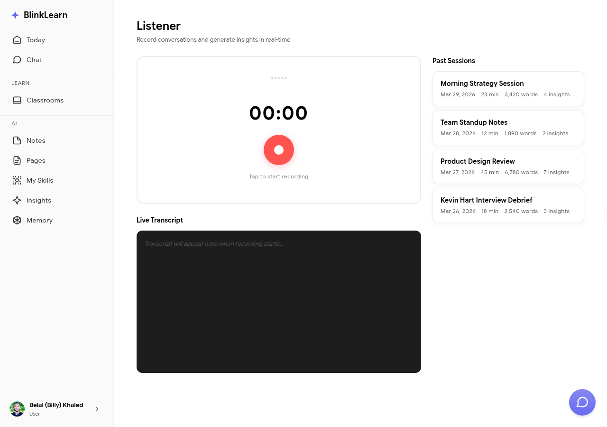

# Listener

**Listener** is BlinkLearn's hands-free audio mode — it reads your learning content aloud so you can learn while doing other things.

## Using Listener

Go to **Listener** in the sidebar and select the content you want to listen to. Listener works with:

- Course lessons
- Classroom content
- Your notes and pages

Press play and BlinkLearn reads the content aloud. Use the playback controls to pause, skip, or adjust speed.

## Offline and background playback

Listener continues playing in the background while you use other apps. On mobile, you can lock your screen and audio keeps playing.

## Learning on the go

Listener is designed for commutes, walks, and any time you want to learn without a screen. Your progress is tracked the same as if you were reading — completed content feeds into Sandra's memory.
