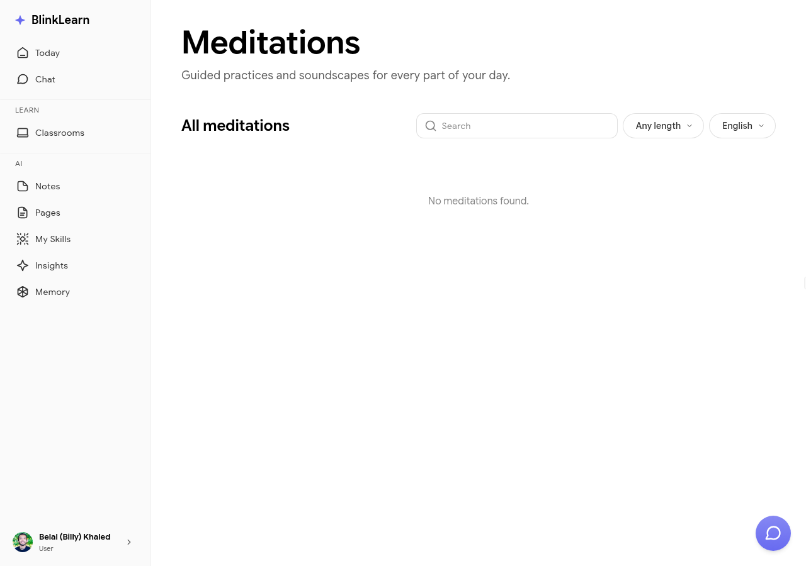

# Meditations

BlinkLearn includes a library of guided meditations that integrate with your learning practice.

## Browsing meditations

Go to **Meditations** in the sidebar to browse the catalog. Meditations are organised by theme, duration, and purpose.

## Starting a meditation

Click a meditation to open the player. Sessions range from a few minutes to longer practices. Your completed meditations are tracked and visible to Sandra — she can incorporate them into your briefings and recommendations.

## Meditations and your learning

Sandra treats meditations as part of your holistic learning practice. If you regularly meditate on focus or creativity, she takes that into account when connecting ideas and making recommendations in [Chat](chat.md) and [Insights](insights.md).

## Scheduling meditations

You can schedule a meditation to appear in your [Today](today.md) agenda. Use the scheduling option on any meditation card to add it to a specific day.
