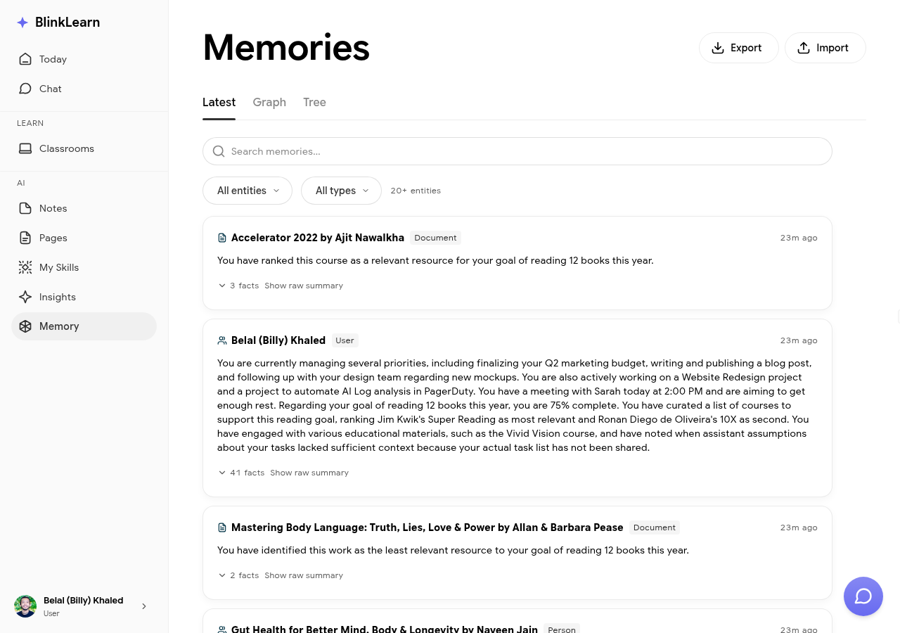

# Memories

Memories are everything Sandra has learned about you through your learning activity — the building blocks of her personalised responses.

## What memories contain

As you use BlinkLearn, Sandra builds up a picture of:

- Topics and themes you engage with repeatedly
- Ideas you've noted as important
- Connections she's made between different pieces of content
- Your stated goals and preferences

These are stored as memories and surface in [Chat](chat.md), [Insights](insights.md), and your [Today](today.md) briefing.

## Viewing your memories

Go to **Memories** in the sidebar to see what Sandra has stored. Each memory entry shows the source content and what Sandra learned from it.

## Managing memories

You can delete individual memory entries if you want Sandra to forget something. This affects future responses but does not affect your learning history or notes.
