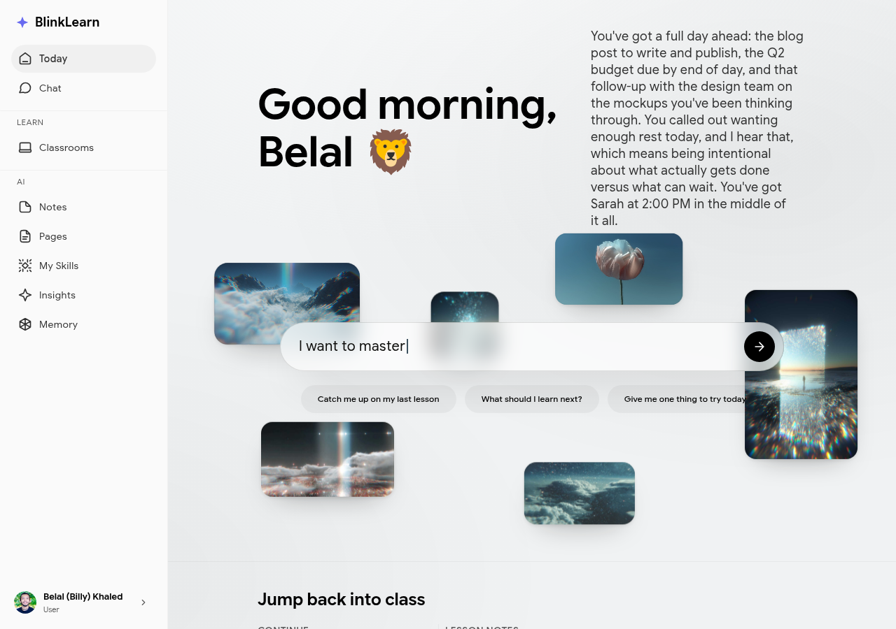

# My AI

**My AI** is where you personalise your AI companion Sandra — her name, communication style, and how she interacts with you.

## Companion settings

In My AI you can:

- **Rename your companion** — give Sandra a custom name that feels right for you
- **Adjust her style** — choose how formal or casual her responses are
- **Set preferences** — tell Sandra what kinds of nudges and suggestions you find most helpful

## Why personalisation matters

Sandra's effectiveness grows as she learns about you. The settings in My AI let you guide that process — telling her upfront how you like to communicate and what you're focused on.

## Resetting your companion

If you want to start fresh, you can reset your companion's personalisation from the My AI page. This clears her stored preferences but keeps your learning history intact.
