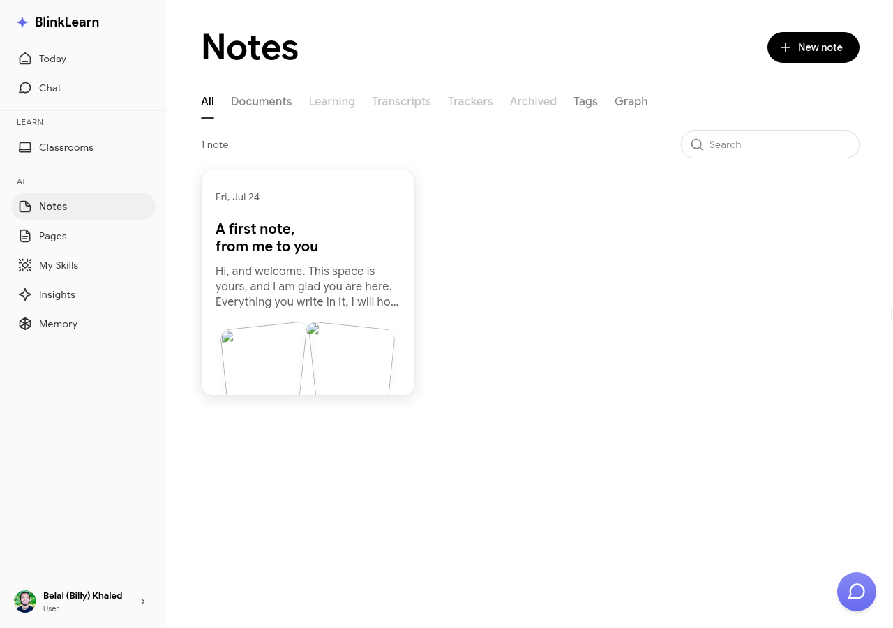

# Notes

Notes let you capture ideas, reflections, and key takeaways as you learn. BlinkLearn notes are smart — Sandra links them to the content they came from and uses them to build your learning memory.

## Creating a note

Go to **Notes** in the sidebar and click **New note**, or take notes directly inside a lesson or classroom session. Notes taken inside content are automatically linked to that lesson.

## Note types

- **Free-form notes** — write anything, anytime
- **In-lesson notes** — captured while a lesson is active, linked to the specific lesson

## Smart linking

Sandra reads your notes as part of your learning history. When you ask her a question in [Chat](chat.md), she can reference relevant notes. Your notes also contribute to [Insights](insights.md) — Sandra may surface connections between note content and other things you've learned.

## Sharing notes

Notes can be shared via a public link. Go to the note and use the share option to generate a link that others can view.
