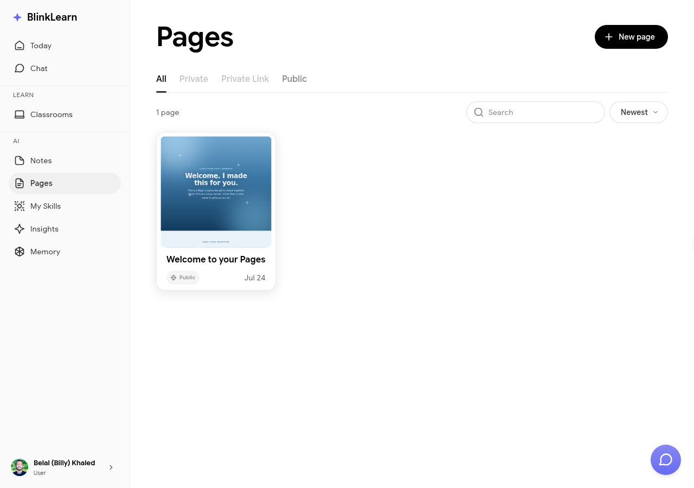

# Pages

Pages are AI-powered documents you can create and edit in BlinkLearn. Sandra can help you draft, expand, and organise content — useful for capturing and synthesising what you've learned.

## Creating a page

Go to **Pages** in the sidebar and click **New page**. Start typing or ask Sandra to help you draft content based on your learning history.

## Collaborating with Sandra

Inside a page, you can ask Sandra to:

- Draft a summary of a topic you've been studying
- Expand on a note or idea
- Organise bullet points into a structured document

## Sharing pages

Pages can be shared with other BlinkLearn users or via a public link. Use the share option at the top of any page to manage access.

## Use cases

- Synthesising key takeaways from a course
- Creating a personal study guide
- Drafting a reflection after a classroom session
