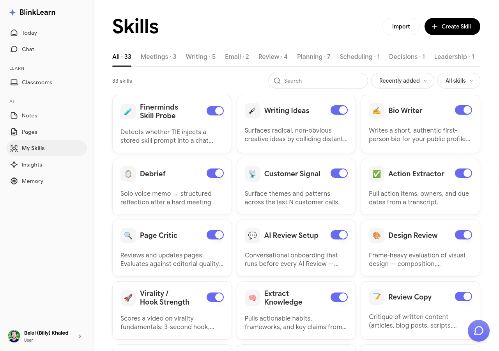

# Skills

Skills are capabilities you can activate to enhance what Sandra can do for you. Each skill extends Sandra's understanding or adds a new type of interaction.

## Browsing skills

Go to **Skills** in the sidebar to see available skills. Each skill card describes what it does and how to activate it.

## Activating a skill

Click a skill card and follow the activation steps. Once active, the skill is available in your [Chat](chat.md) with Sandra. You can deactivate skills at any time from the same page.

## Examples of skills

Skills can help Sandra:

- Connect your learning to specific frameworks or methods
- Provide more structured summaries after lessons
- Track specific types of progress you care about

The skills catalog grows over time as new capabilities are added.
