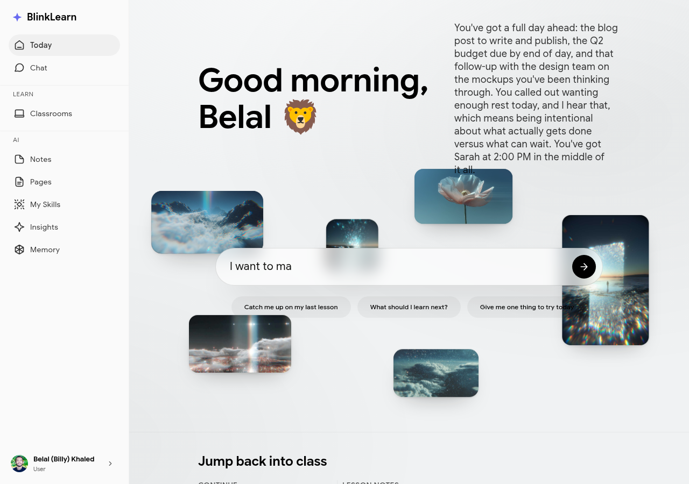

# Today

The **Today** view is your personalised daily learning briefing, prepared by Sandra each morning.

## What you'll find

- **Morning briefing** — a digest of your recent learning activity, key takeaways, and anything Sandra thinks is worth revisiting
- **Your agenda** — upcoming lessons, classrooms, and meditations scheduled for today
- **Proactive suggestions** — Sandra's recommendations based on your goals and what you've been working on

## How it's generated

Sandra draws from everything she knows about you: completed lessons, notes you've taken, insights from your content, and your stated learning goals. Each day's briefing is unique to your learning journey.

The briefing refreshes overnight. Open BlinkLearn in the morning to see what Sandra has prepared.

## Taking action from Today

Click any item in the agenda to jump directly into a lesson or classroom. Sandra's suggestions link directly to the content she's recommending.
