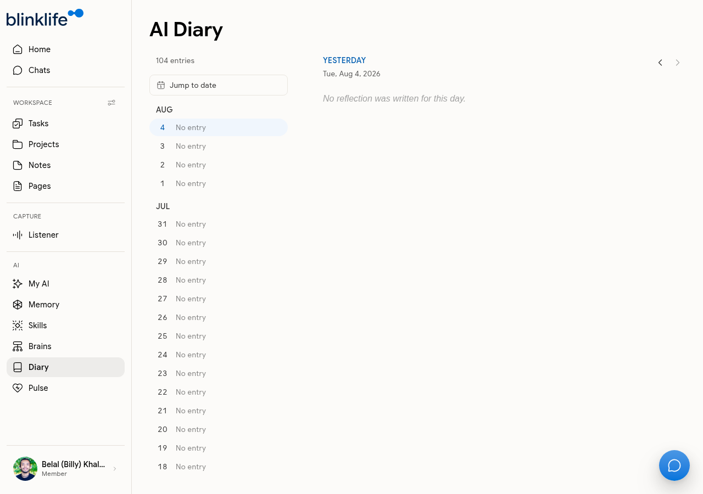

# AI Diary

**AI Diary** is a running journal of your days, written automatically by Sandra. Each entry is generated from your activity — conversations, notes, tasks completed, and events — without you having to write anything yourself.

## How the diary works

Sandra writes a diary entry for each day based on:
- Your conversations with her that day
- Notes and tasks you created
- Calendar events from your connected calendar
- Any explicit reflections you shared in Chat

The **Nightly Reflection** routine (10:00 PM by default) triggers this — Sandra writes the entry as part of your end-of-day routine.

## Viewing entries

Go to **Diary** in the sidebar. The diary shows a calendar-style list of dates. Tap any date to read that day's entry.

- Dates with entries show the entry preview
- Dates with no activity show **No entry**

Use **Jump to date** to navigate quickly to a specific month or date.

## 104 entries

The diary accumulates over time. Your account may already have entries from previous activity even if recent dates show "No entry" — use **Load older** at the bottom of the list to see earlier months.

## Editing the Nightly routine

The Daily Diary is generated by the **Daily Diary** default routine (11:00 PM). To change the time or adjust what Sandra includes, go to [Pulse → Routines](pulse.md) and click **Edit** on the Daily Diary routine.

## Requesting a diary entry manually

You can also ask Sandra in Chat to write a diary entry on demand:
- "Write a diary entry for today"
- "Summarise what I did this week as a diary"
