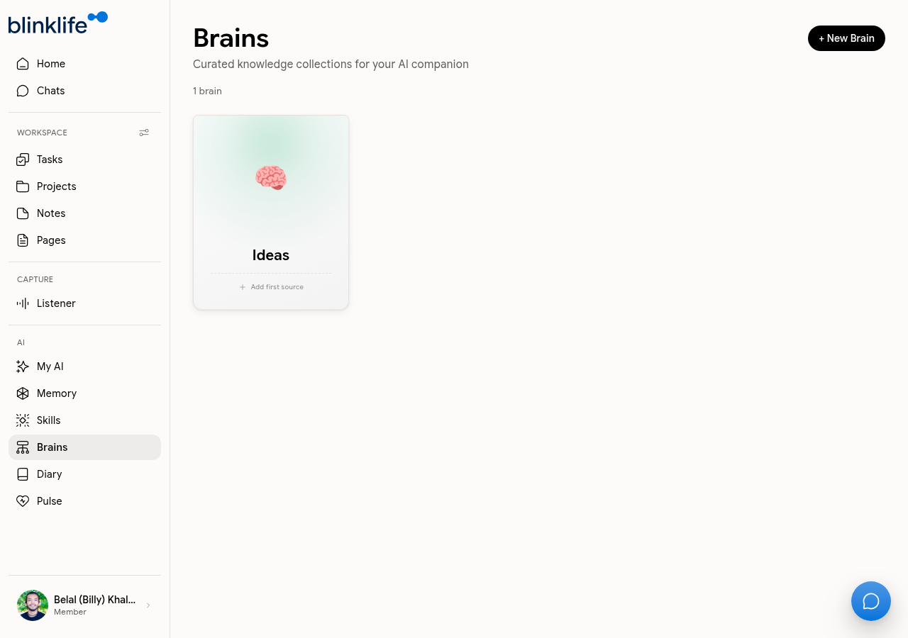

# Brains

**Brains** are curated knowledge collections that you build and Sandra draws from. When you add sources to a Brain, Sandra can reference that content when answering questions — making her responses more grounded in your specific context.

## What is a Brain?

A Brain is a named collection of sources — documents, URLs, files, or text — that you want Sandra to know about. You might create a Brain for a project, a topic you are researching, or a body of reference material.

## Creating a Brain

1. Go to **Brains** in the sidebar and click **+ New Brain**.
2. Give the Brain a name (e.g. "Q3 Strategy", "Reading List", "Client Background").
3. Add sources to the Brain using **Add first source**.

## Adding sources

You can add various source types to a Brain — documents you upload, URLs, notes, or manually entered text. Sandra indexes the content and can reference it in conversation.

## Using a Brain in Chat

When you chat with Sandra, she automatically draws on the Brains you have built. You can also reference a Brain explicitly:

- "Based on the Ideas Brain, what themes come up most?"
- "Summarise the content in my Q3 Strategy Brain"

## Brain tips

- Keep each Brain focused on a single topic or project for better results
- Add sources as you collect them — Sandra's answers improve as the Brain grows
- You can have multiple Brains active simultaneously
