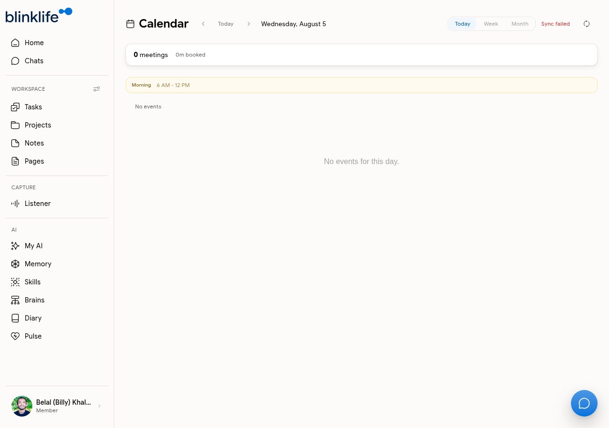

# Calendar

The **Calendar** shows your upcoming events and helps Sandra brief you on your day. It requires connecting a calendar integration to populate with events.

## Views

Go to **Calendar** in the sidebar to switch between views:

| View | What it shows |
|------|--------------|
| **Today** | Today's events with time slots |
| **Week** | Full week at a glance |
| **Month** | Monthly overview |

The calendar shows total meetings booked and total time for the current view.

## Connecting a calendar

Calendar events come from your connected Google Calendar. If the calendar shows **Sync failed** or no events, you need to connect the integration first.

Go to [Google Calendar integration](../integrations/google-calendar.md) for setup steps.

## Sandra and your calendar

Once your calendar is connected, Sandra references your events:

- **Home briefings** — Sandra surfaces upcoming meetings proactively ("You've got Sarah at 2:00 PM today")
- **Listener routines** — Sandra can create Listener session notes linked to your calendar events
- **Calendar routines** — enables additional automated routines in Pulse

If you see "Sync failed", see [Calendar Sync Issues](../troubleshooting/calendar-sync.md).
