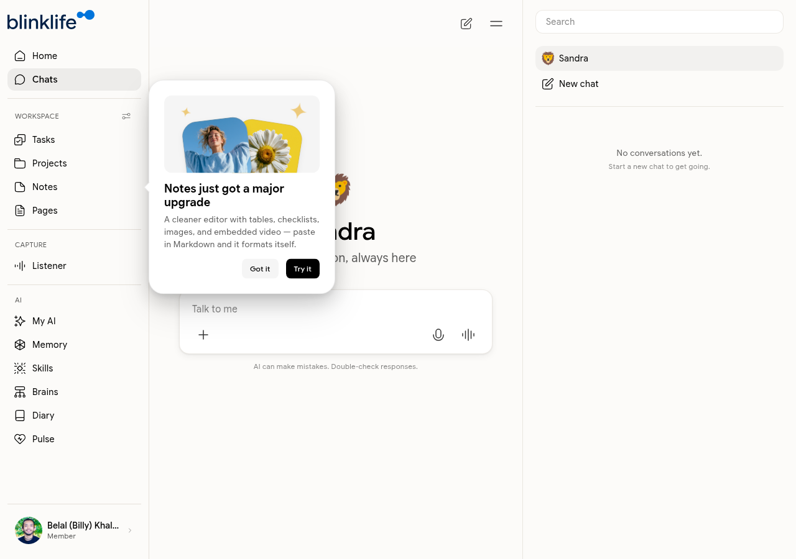

# Chat

**Chat** is your primary way to interact with Sandra. Every conversation is stored and Sandra carries context across sessions — she remembers what you discussed previously.

## Starting a conversation

Go to **Chats** in the sidebar and click **New chat**. Type anything — Sandra responds as your companion, drawing on what she knows about you from your notes, tasks, memories, and past conversations.

## What Sandra can do in Chat

- Answer questions and give opinions based on your context
- Help you think through a decision or problem
- Create tasks, notes, and pages from within the conversation
- Invoke skills (e.g. run a Weekly Review or Meeting Summary)
- Brief you on your day, upcoming meetings, or open tasks
- Reflect on your patterns and habits over time

## Conversation history

All your chats are stored in the sidebar under **Chats**. Click any conversation to resume it. Sandra treats each chat as continuous — she remembers what was said even if you start a new session.

## Invoking skills from Chat

During a conversation you can trigger any skill directly:

1. Type what you want to do (e.g. "run a weekly review" or "summarize my notes from this week")
2. Sandra will invoke the relevant skill and guide you through it

You can also open the Skills panel from within Chat to browse and select a skill manually.

## Sandra's limits

Sandra will not give medical, legal, or financial advice. If a question falls outside her scope, she will acknowledge it and suggest a qualified professional.
