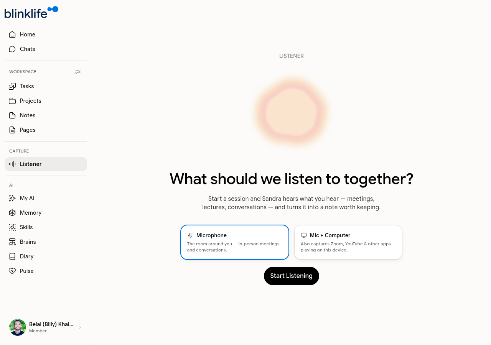

# Listener

**Listener** captures audio during meetings, lectures, and conversations — and turns it into a structured note. Sandra listens alongside you and produces a note worth keeping.

## Starting a session

Go to **Listener** in the sidebar (under CAPTURE). Choose your capture mode:

| Mode | What it captures |
|------|----------------|
| **Microphone** | The room around you — in-person meetings, conversations, lectures |
| **Mic + Computer** | Microphone audio plus anything playing on your device (Zoom, Google Meet, YouTube, etc.) |

Click **Start Listening** to begin. Sandra starts transcribing in real time.

## During a session

While Listener is active, Sandra transcribes what she hears. You can:

- Leave it running in the background while you focus on the meeting
- Switch to another tab — Listener continues capturing

## After a session

When you stop the session, Sandra processes the transcript and creates a structured note. The note is saved automatically and appears in the **Listener** tab in Notes. It will include:

- A summary of the key points discussed
- Action items extracted from the conversation
- Any decisions or commitments mentioned

## Finding listener notes

Go to **Notes → Listener** tab to see all notes generated from Listener sessions. Listener notes are tagged and kept separate from your manually created notes.

## Tips for best results

- Use **Mic + Computer** for Zoom or Google Meet calls — it captures both your audio and the other speakers
- Use **Microphone** for in-person meetings in a quiet room
- Speak clearly and avoid heavy background noise for better transcription accuracy
