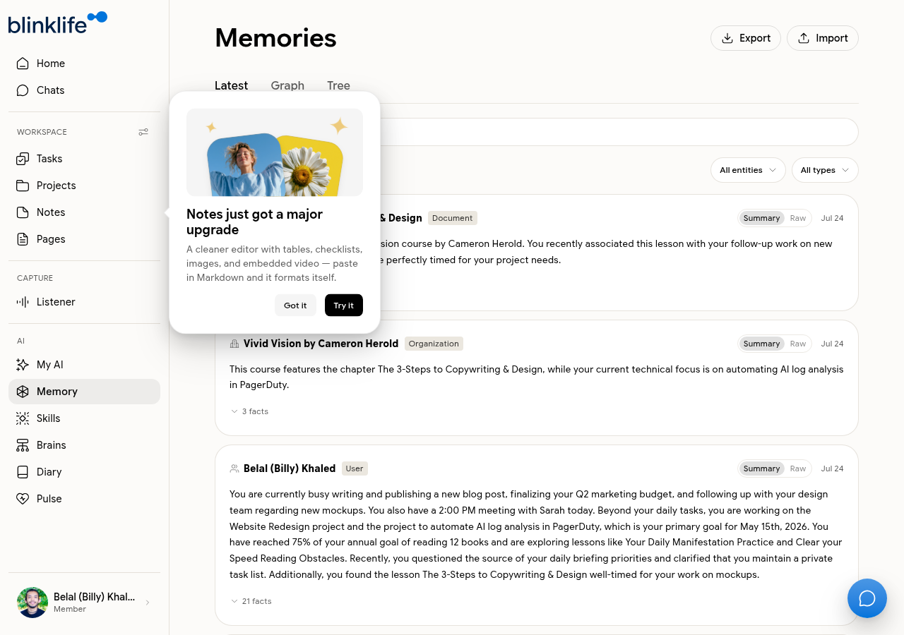

# Memories

**Memories** is Sandra's knowledge graph — everything she has learned about you through your conversations, notes, and interactions.

## What Sandra remembers

Sandra builds memories automatically. They are organised as entity types:

| Type | Examples |
|------|---------|
| **Document** | Notes, pages, files she has read |
| **Organization** | Companies, teams, or services you've mentioned |
| **Person** | People you've discussed |
| **Goal** | Objectives you've shared with Sandra |
| **Topic** | Recurring themes (productivity, health, strategy) |

## Viewing memories

Go to **Memory** in the sidebar. You can switch between three views:

| View | What it shows |
|------|--------------|
| **Latest** | Most recently added memories, in chronological order |
| **Graph** | A visual network showing how memories connect |
| **Tree** | A hierarchical view grouped by type |

The count shown (e.g. "14 entities") reflects how many distinct memories Sandra has built.

## Exporting and importing

Use the **Export** and **Import** buttons at the top of the Memories page to back up or migrate your memory graph.

## Updating memories

Memories are built automatically — you cannot edit them directly. To update or remove a specific memory, ask Sandra in Chat:

- "Forget that I'm working on the PagerDuty project"
- "Update my role — I'm now focusing on infrastructure"
- "Remove the memory about the Ideas Brain"

Sandra will acknowledge the change and update her knowledge graph.

## How memories improve Sandra

The more Sandra remembers, the more relevant her responses become. She references memories to:
- Avoid asking you the same questions twice
- Connect current conversations to past ones
- Personalise briefings and suggestions
