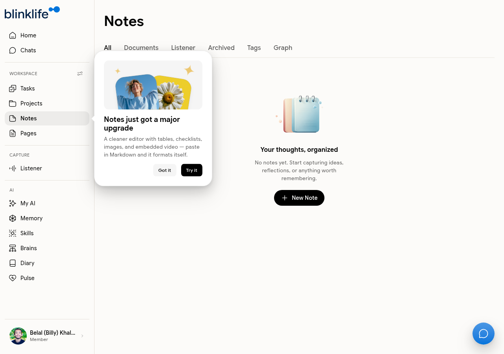
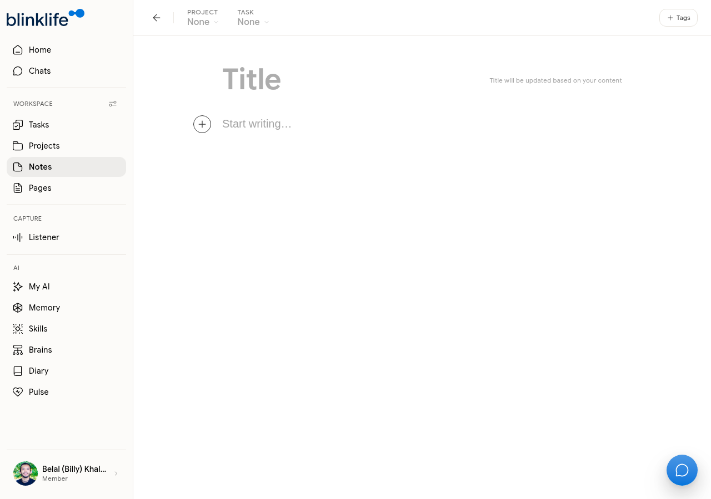

# Notes

Notes is BlinkLife's workspace for capturing ideas, reflections, meeting notes, and anything worth keeping. Notes are integrated with your tasks, projects, and Sandra.



## Creating a note

Go to **Notes** in the sidebar and click **New Note**. A blank editor opens.



The title is set automatically based on your content — you do not need to type one separately.

## The editor

The notes editor supports rich formatting:

| Block type | How to add |
|-----------|-----------|
| Headings (H1–H3) | Type `#`, `##`, or `###` then space |
| Bullet list | Type `-` then space |
| Numbered list | Type `1.` then space |
| Checklist / task | Type `[]` then space |
| Table | Use the block menu |
| Image | Paste, drag, or use the block menu |
| Video embed | Paste a video URL |
| Divider | Type `---` |
| Code block | Type ` ``` ` |

You can also **paste Markdown directly** — the editor formats it automatically.

## Linking to projects and tasks

At the top of every note, you can assign it to a **Project** and a **Task**. This keeps your notes connected to the work they belong to.

## Note categories

Notes are organised into tabs:

| Tab | What it shows |
|-----|--------------|
| **All** | Every note |
| **Documents** | Notes created manually |
| **Listener** | Notes generated from Listener sessions |
| **Archived** | Notes you've archived |
| **Tags** | Notes filtered by tag |
| **Graph** | A visual graph of how your notes connect |

## Sandra in Notes

The AI panel on the right side of the editor gives you access to Sandra while writing. You can ask her to expand a section, summarize a note, or extract action items — without leaving the editor.
