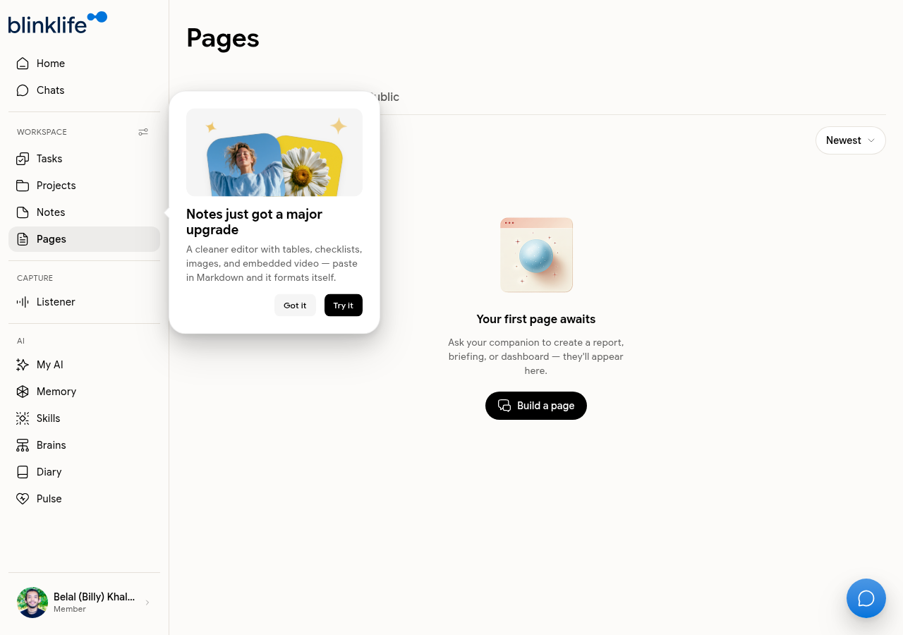

# Pages

**Pages** are AI-generated documents — reports, briefings, dashboards, and summaries that Sandra creates for you. They live in one place and can be kept private or shared.

## How pages are created

Ask Sandra in Chat to produce a document:

- "Create a weekly summary of my notes"
- "Build a project status page for the PagerDuty automation"
- "Write a briefing I can share with my team"

Sandra generates the page and it appears in your Pages list.

## Visibility settings

| Visibility | Access |
|-----------|--------|
| **Private** | Only you |
| **Private Link** | Anyone with the URL |
| **Public** | Discoverable by others |

Change visibility from within any page at any time.

## Managing pages

Go to **Pages** in the sidebar to see all your generated documents. Tabs let you filter by visibility:

- **All** — every page
- **Private** — private-only pages
- **Private Link** — link-shared pages
- **Public** — publicly visible pages
- **Newest** — sorted by creation date

From the pages list you can open, share, or delete any page.
