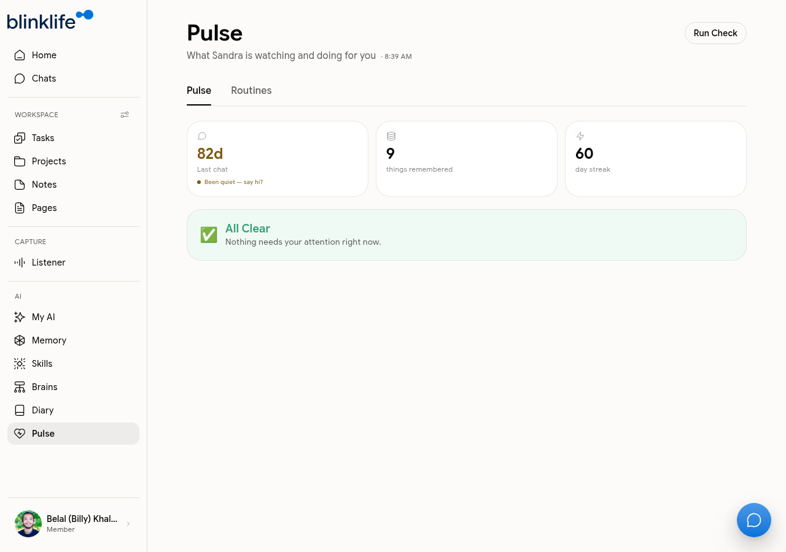
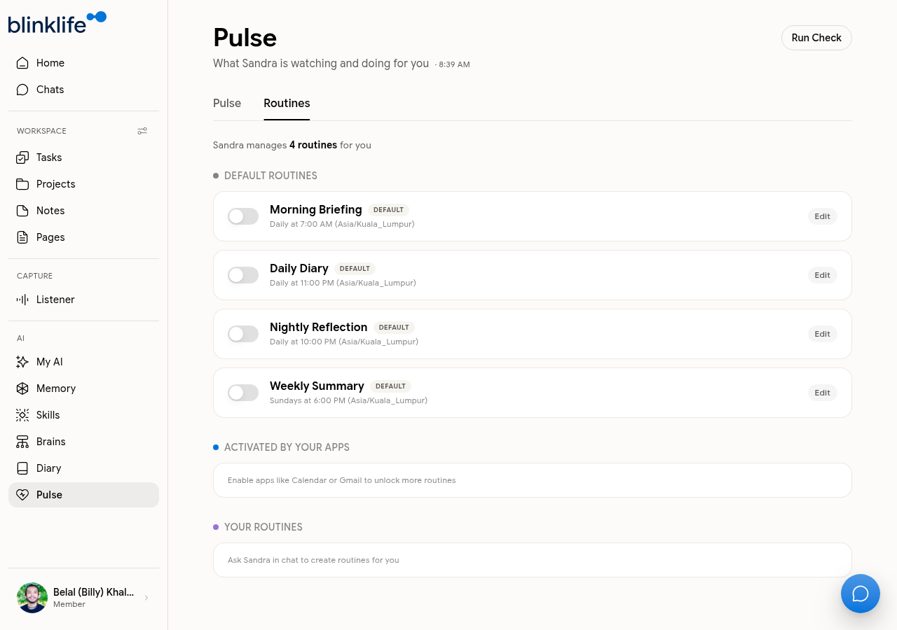

# Pulse & Routines

**Pulse** is Sandra's activity monitor — a summary of what she is watching and doing for you. **Routines** are scheduled actions Sandra runs automatically on your behalf.

## Pulse

Go to **Pulse** in the sidebar to see Sandra's status at a glance.

| Stat | What it means |
|------|--------------|
| **Last chat** | How long since your most recent conversation with Sandra |
| **Things remembered** | Total memories Sandra has built about you |
| **Day streak** | Consecutive days you have been active |
| **Status** | "All Clear" or a list of items needing your attention |

Click **Run Check** to trigger a fresh Pulse evaluation — Sandra reviews what she knows and updates the status.

## Routines

Go to **Pulse → Routines** to see all routines Sandra runs for you.

### Default routines

BlinkLife includes four default routines that activate automatically:

| Routine | When it runs | What it does |
|---------|-------------|-------------|
| **Morning Briefing** | Daily at 7:00 AM | Sandra reviews your calendar, tasks, and context — sends you a briefing for the day |
| **Daily Diary** | Daily at 11:00 PM | Sandra writes a diary entry based on your day's activity |
| **Nightly Reflection** | Daily at 10:00 PM | Sandra prompts a short reflection on your day |
| **Weekly Summary** | Sundays at 6:00 PM | Sandra compiles a summary of the week |

All times are shown in your local timezone.

### App-activated routines

Connecting integrations (Calendar, Gmail) unlocks additional routines. These appear under **Activated by Your Apps** once the relevant integration is set up.

### Custom routines

Ask Sandra in Chat to create a routine:
- "Create a routine that runs every Monday morning and reviews my open projects"
- "Add a weekly check-in on my reading goal every Friday at 5pm"

Custom routines appear under **Your Routines** in the Routines tab.

### Editing routines

Tap **Edit** next to any routine to change its schedule or instructions.
