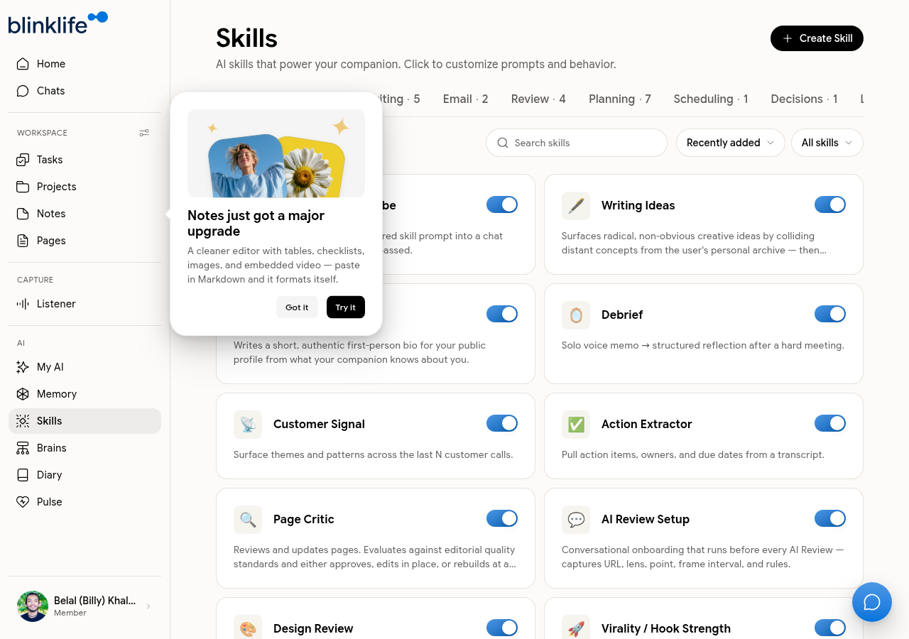

# Skills

**Skills** are specialized AI tools that extend what Sandra can do. Each skill is a focused capability with a defined purpose — invoked in Chat or triggered automatically.

## Browsing the library

Go to **Skills** in the sidebar to see the full library — 33 skills at launch, organized by category.

| Category | Count | Examples |
|----------|-------|---------|
| **Meetings** | 3 | Meeting Summary, Action Items, Decision Log |
| **Writing** | 5 | Note Cleaner, Page Designer, Email Draft |
| **Email** | 2 | Email Reply, Email Summary |
| **Review** | 4 | Design Review, Page Critic, Feedback Synthesizer |
| **Planning** | 7 | Goal Review, Daily Briefing, Weekly Review, Project Plan |
| **Scheduling** | 1 | Calendar Planner |
| **Decisions** | 1 | Decision Framework |
| **Leadership** | 1 | Team Update |
| **Memory** | 2 | Memory Sweep, Knowledge Capture |
| **Learning** | 3 | Extract Knowledge, Web Reader, Concept Explainer |
| **Health** | 1 | Health Check-in |
| **Social Media** | 2 | Post Draft, Thread Writer |

## Using a skill

1. Open **Chat** and describe what you want to do (e.g. "summarize today's meeting notes")
2. Sandra identifies the relevant skill and invokes it, or you can open the Skills panel inside Chat and select one manually

## Creating a custom skill

Click **Create Skill** at the top of the Skills page to build your own. Define the skill's purpose, trigger, and expected output. Custom skills appear in your library alongside the built-in ones.

## Customising skill prompts

Click any skill to open its settings and edit the underlying prompt. This lets you tailor how a skill behaves to your specific needs and preferences.
