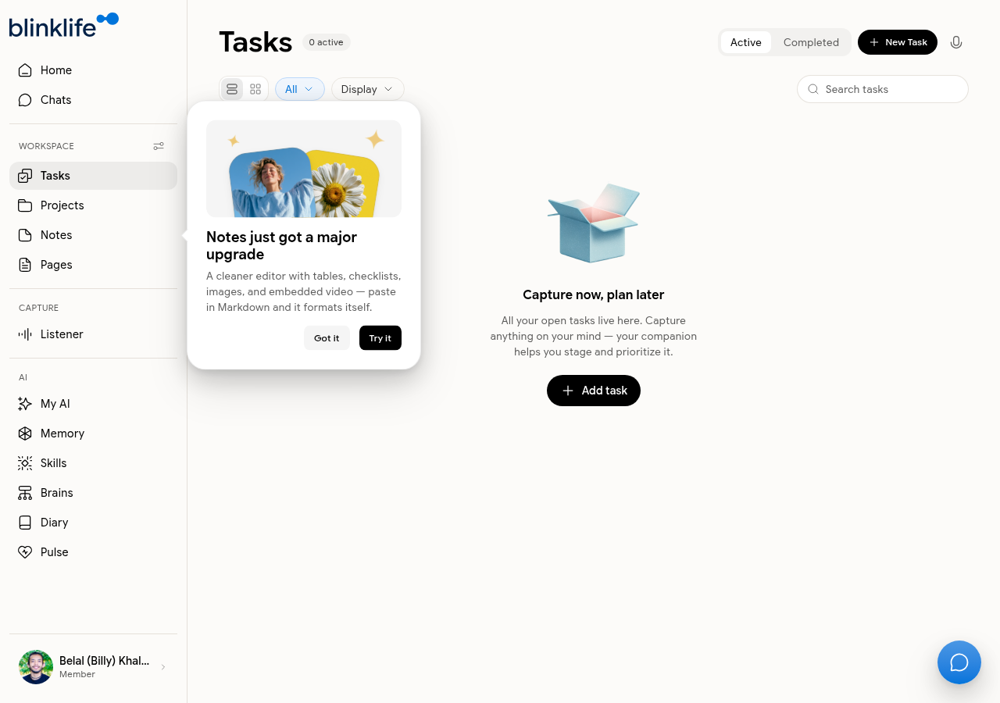
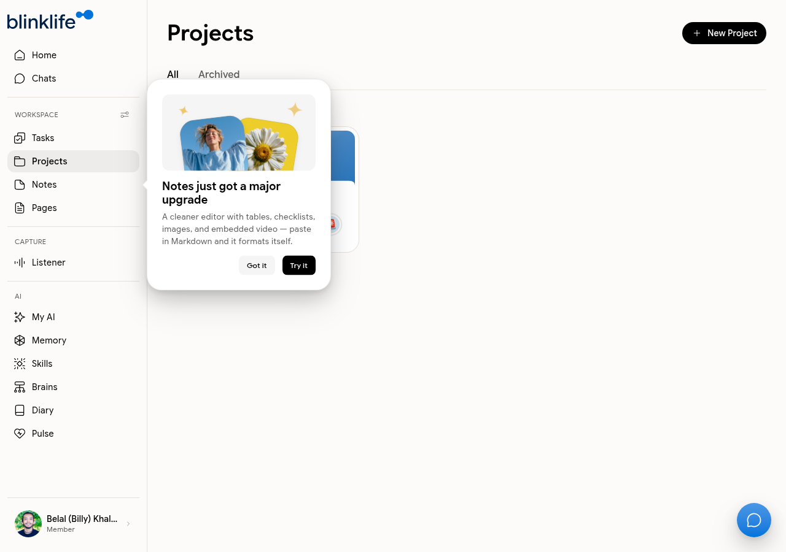

# Tasks & Projects

BlinkLife lets you capture tasks quickly and organise them into projects. Sandra is aware of your tasks and references them in briefings and conversations.

## Tasks

Go to **Tasks** in the sidebar to see all your open tasks.

### Creating a task

Click **Add task** or **New Task** to capture something quickly. Tasks can be created:

- Directly from the Tasks page
- By asking Sandra in Chat ("add a task: review the proposal by Friday")
- From within a note using a checklist block

### Managing tasks

| Tab | What it shows |
|-----|--------------|
| **Active** | All open, incomplete tasks |
| **Completed** | Tasks you've marked done |

Use the **Display** options to filter and sort your task list.

## Projects

Go to **Projects** in the sidebar to organise tasks into named projects.

### Creating a project

Click **New Project** and give it a name. Projects show a count of open and completed tasks.

### Linking tasks to a project

When creating or editing a task, select the project it belongs to. You can also link a note to a project from within the note editor.

### Project tabs

| Tab | What it shows |
|-----|--------------|
| **All** | Every active project |
| **Archived** | Projects you've completed or archived |

## Sandra and your tasks

Sandra references your tasks on the Home page briefing and in Chat. If you ask her "what do I have on my plate?", she will summarise your active tasks and flag anything time-sensitive.
