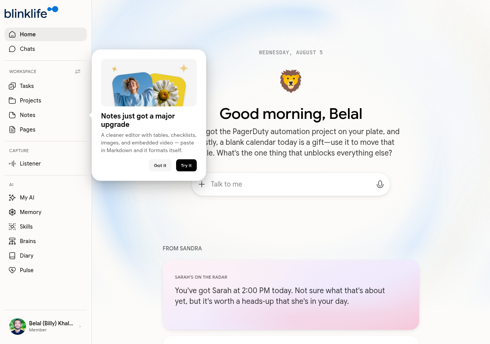

# Your Home Page

When you log in, BlinkLife opens on the **Home** page (`/today`) — your daily command center.

## What you see on Home

| Section | What it shows |
|---------|--------------|
| **Daily greeting** | Sandra's good morning message, personalised to your day |
| **FROM SANDRA** | Proactive briefings — upcoming meetings, items Sandra flagged, context you should know |
| **Calendar preview** | Today's events pulled from your connected calendar |
| **Tasks** | Active tasks Sandra is aware of |

## Sandra's briefings

Sandra monitors what she knows about your day and surfaces relevant context without you asking. Examples:

- "You've got a meeting with Sarah at 2:00 PM — not sure what it's about yet, worth a heads-up."
- "You've got the PagerDuty automation project on your plate."

These briefings come from your connected calendar, your tasks, your notes, and your conversation history with Sandra.

## Sidebar navigation

The sidebar on the left is your primary navigation. Sections:

| Section | Items |
|---------|-------|
| — | Home, Chats |
| **WORKSPACE** | Tasks, Projects, Notes, Pages |
| **CAPTURE** | Listener |
| **AI** | My AI, Memory, Skills, Brains, Diary, Pulse |

## What to do in your first week

1. **Chat with Sandra** — start a conversation and let her get to know you
2. **Create a note** — capture something you're working on
3. **Connect your calendar** — go to [Google Calendar integration](../integrations/google-calendar.md) so Sandra can brief you on meetings
4. **Check Pulse** — see what Sandra is monitoring and enable your default routines
