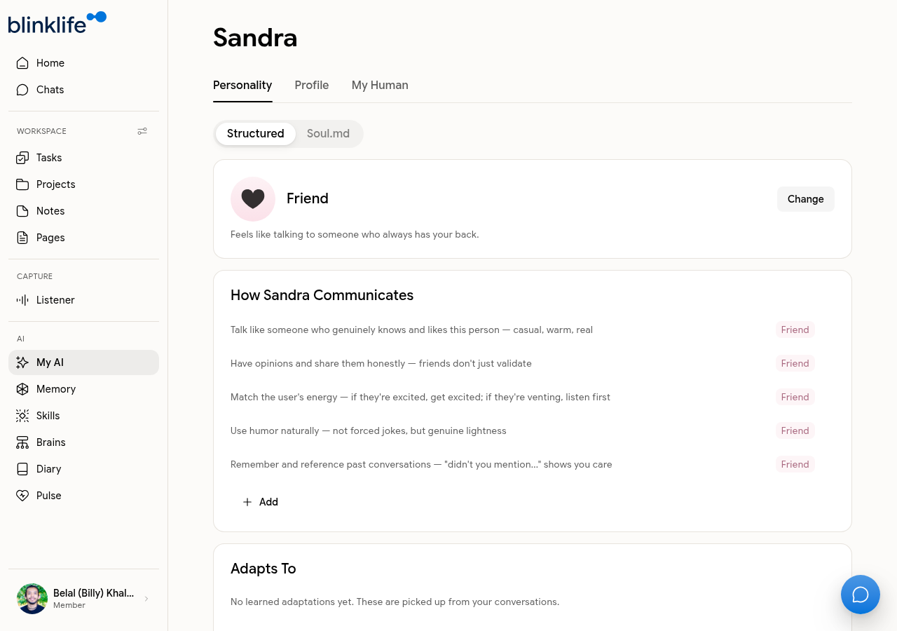

# Personalising Your Companion

Sandra is your AI companion. By default she uses the **Friend** archetype — casual, warm, and direct. You can change her personality, name, and how she communicates from **My AI** in the sidebar.

## Personality archetypes

Go to **My AI → Personality** to choose an archetype. Each archetype defines how Sandra speaks, what she prioritises, and how she frames her responses. The default is **Friend**.

**Friend** archetype characteristics:
- Talks like someone who genuinely knows and likes you — casual, warm, real
- Has opinions and shares them honestly
- Matches your energy
- Uses humor naturally
- References past conversations to show she remembers

Other archetypes are available and can be selected to change Sandra's tone entirely.

## Customising communication style

Within the personality settings you can also edit the specific rules Sandra follows — add, remove, or rewrite the behaviors listed under your current archetype. Changes take effect on the next message.

## Renaming your companion

Go to **My AI → Profile** to rename Sandra to anything you prefer. The name change applies everywhere in the interface immediately.

## My Human and Soul.md tabs

- **My Human** — lets you describe yourself so Sandra has context about who you are
- **Soul.md** — an advanced view of Sandra's core instructions in structured format
