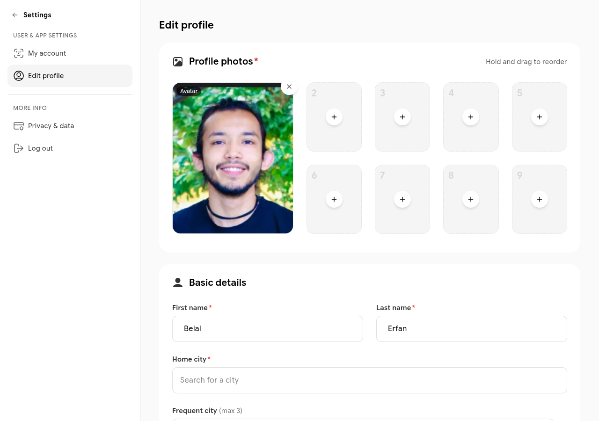

# Editing Your Profile

Your profile tells the community who you are. Other members see it when browsing People, inside networks, and in chats.

Go to **Settings → Edit profile** to make changes.

## Profile photos

Upload up to nine photos. The first photo in the order is your avatar — the image shown on your member card and in chats. Drag and drop photos to reorder them.

## Basic details

| Field | Notes |
|-------|-------|
| First name / Last name | Your display name across Finerminds |
| Home city | Used for the "Near me" filter on the People page |
| Frequent cities | Up to three cities you travel to regularly |
| Spoken languages | Up to ten languages |
| Interests | Up to 25 tags — used to surface relevant members and content |
| About me | Free-text bio, up to 2,000 characters. Click **Help me write** for AI assistance |

## Profession

| Field | Notes |
|-------|-------|
| Job title | Your current role |
| Company | Your employer |
| Industry | Select from the industry list |
| Field of work | Sub-category within your industry |

## Social links

Add links to your website, Instagram, Facebook, X (Twitter), LinkedIn, or YouTube. These appear on your public profile page.

## Saving changes

Click **Save** at the bottom of the page. Changes take effect immediately.
