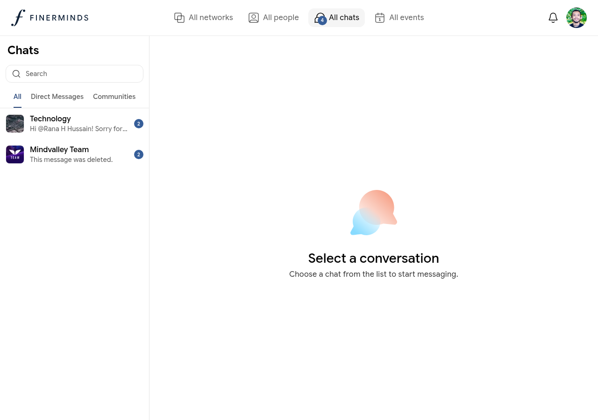

# Chats

Chats is your messaging hub — for direct one-on-one conversations and group discussions within your networks.

## Conversation types

Chats are split into three tabs:

| Tab | What it contains |
|-----|-----------------|
| **All** | Every conversation, most recent first |
| **Direct Messages** | Private one-on-one conversations with other members |
| **Communities** | Group chats tied to your networks |

## Starting a direct message

1. Go to **All people** and open any member's profile
2. Click **Message** — a direct message thread opens automatically
3. Type your message and press **Enter** or click **Send**

Alternatively, go to **Chats** and use the compose button to search for a member by name.

## Community chats

Each network has a shared group chat accessible from the network's **Chat** tab. All members of that network can read and post there.

## Reading and replying

Click any conversation in the left panel to open it on the right. Type in the message box at the bottom and press **Enter** to send.

Unread conversations are shown with a badge count on the **All chats** sidebar item and on the individual thread.

## Notifications

You will receive an in-app notification when someone messages you directly or mentions you in a community chat. Notification settings can be adjusted in your device or browser preferences.
