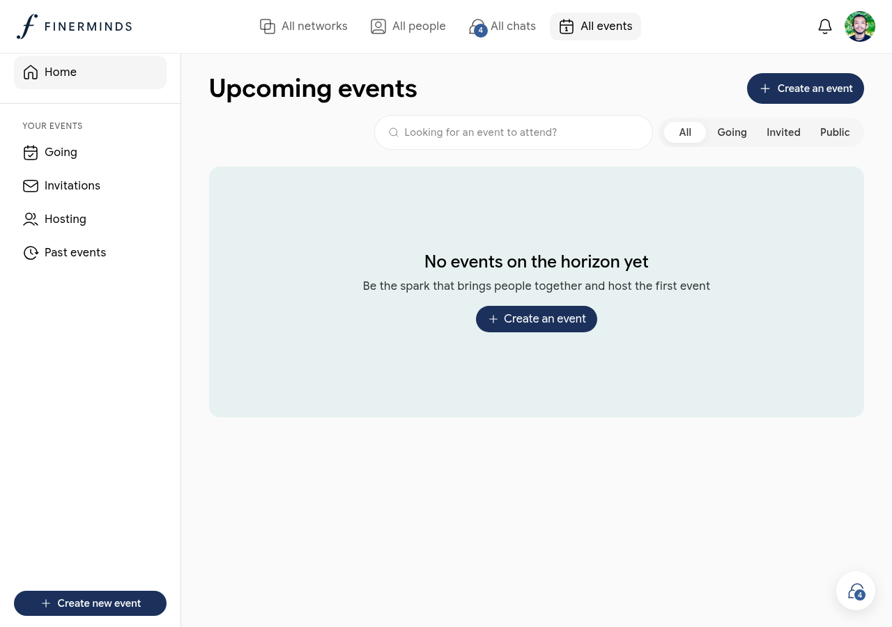

# Events

Events lets you create, discover, and attend community gatherings — virtual or in-person — organised within your networks.

## Finding events

Go to **All events** in the sidebar. The page is organised into sections:

| Section | What it shows |
|---------|--------------|
| **Going** | Events you have confirmed attendance for |
| **Invitations** | Events you have been invited to but not yet responded |
| **Hosting** | Events you created |
| **Past events** | Events that have already taken place |
| **Upcoming events** | All upcoming public events across your networks |

## Creating an event

1. Click **Create new event** in the sidebar or **Create an event** on the events page
2. Fill in the event details — title, date, time, location or virtual link, and description
3. Choose which network the event belongs to
4. Set visibility: **Public** (anyone in the network can see it) or **Invite only**
5. Click **Create** to publish

Once created, the event appears in your **Hosting** tab and in the Events tab of the relevant network.

## Responding to an event

On any event card or event detail page:

- Click **Going** to confirm attendance
- Click **Not going** to decline
- Click **Interested** if you are undecided

For invite-only events, you can only respond if you received an invitation.

## Managing your events

Open any event you are hosting to:

- Edit details (title, date, description, location)
- Invite specific members
- View the attendee list
- Cancel the event

## Events inside networks

Events created within a network are visible to all members of that network under the network's **Events** tab. See [Networks](networks.md) for more.
