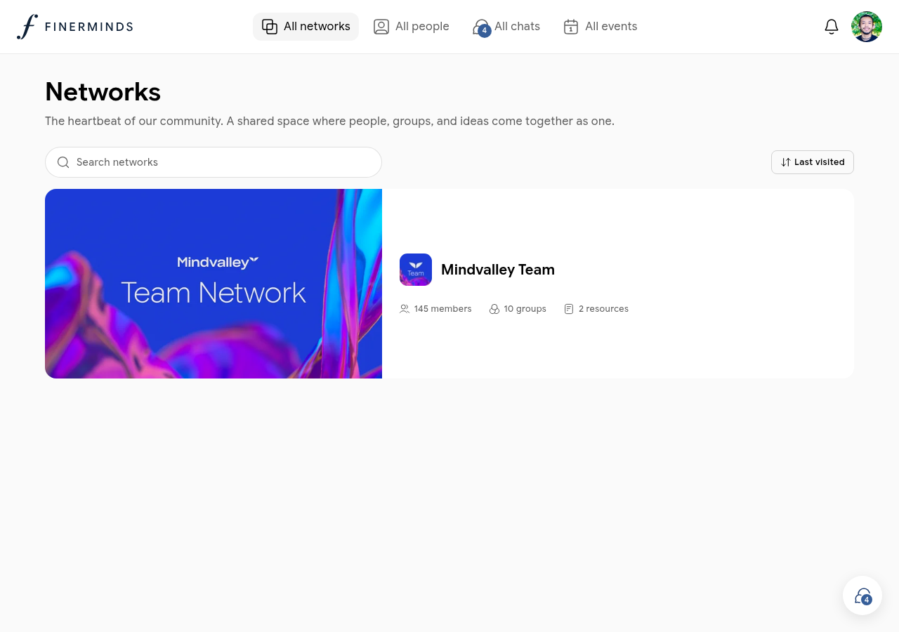
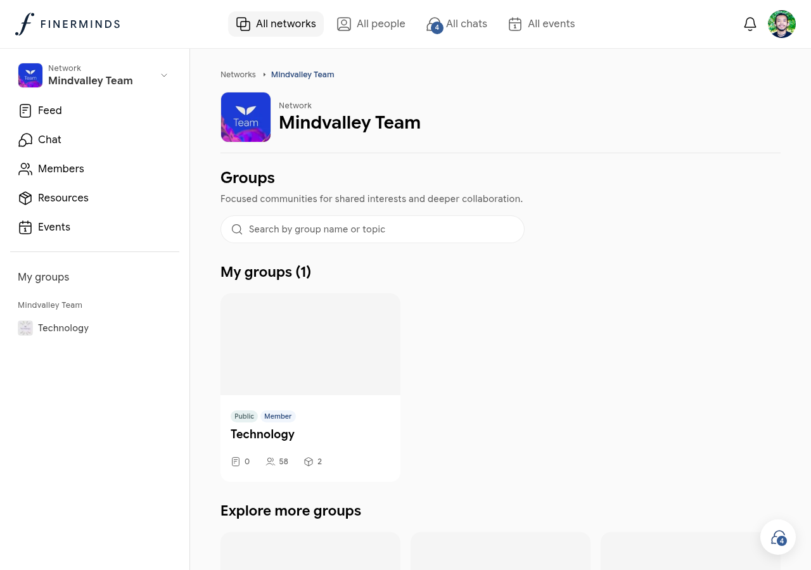
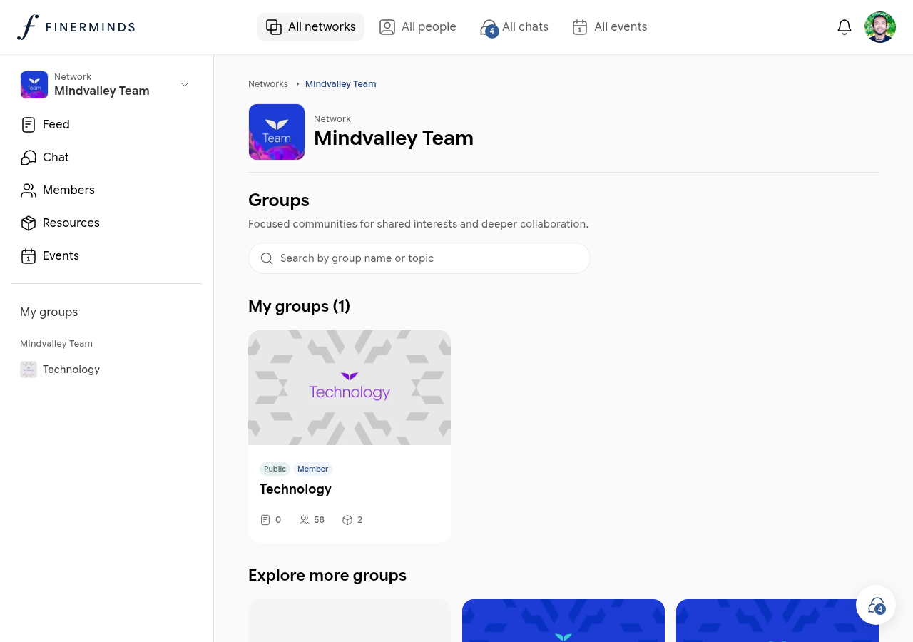

# Networks

Networks are the heartbeat of Finerminds — shared community spaces where members, groups, conversations, resources, and events come together.

## Browsing networks

Go to **All networks** in the sidebar to see every network you belong to and any public networks you can join. Each card shows the number of members, groups, and resources.

## Inside a network

Click any network to open it. Every network has six tabs:

| Tab | What it contains |
|-----|-----------------|
| **Feed** | Posts and updates from all members of this network |
| **Chat** | A shared group chat for quick conversations |
| **Members** | Everyone in the network, filterable by city, industry, language, and interests |
| **Resources** | Links and materials shared by members |
| **Events** | Events happening within this network |

Your joined groups are listed in the left sidebar panel under **My groups**.

## Groups

Each network contains groups — smaller focused communities for specific interests or teams.

Groups can be:

- **Public** — anyone in the network can see and join
- **Private** — invite-only; content is hidden until you are a member

To join a public group, click **Join** on the group card. For private groups, request an invitation from a group admin.

## Members

The **Members** tab lists everyone in the network. Use the filters at the top to find members by:

- **Near me** — members in a similar location
- **City** — filter by home or frequent city
- **Industry** — filter by professional industry
- **Languages** — filter by spoken language
- **Interests** — filter by shared interest tags

Click any member card to open their profile.

## Resources

The **Resources** tab is a shared library for the network. Any member can add a resource by pasting a link to an article, tool, or website. Click **New resource** to contribute.

## Network events

Events created within a network appear under the **Events** tab. See [Events](events.md) for how to create and manage them.
