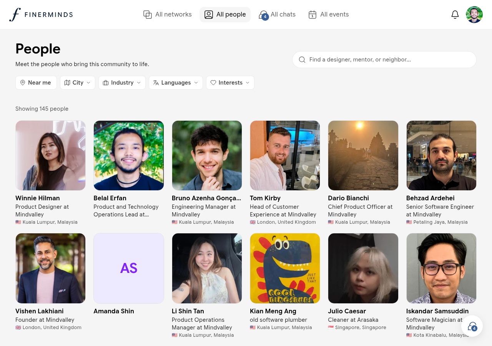
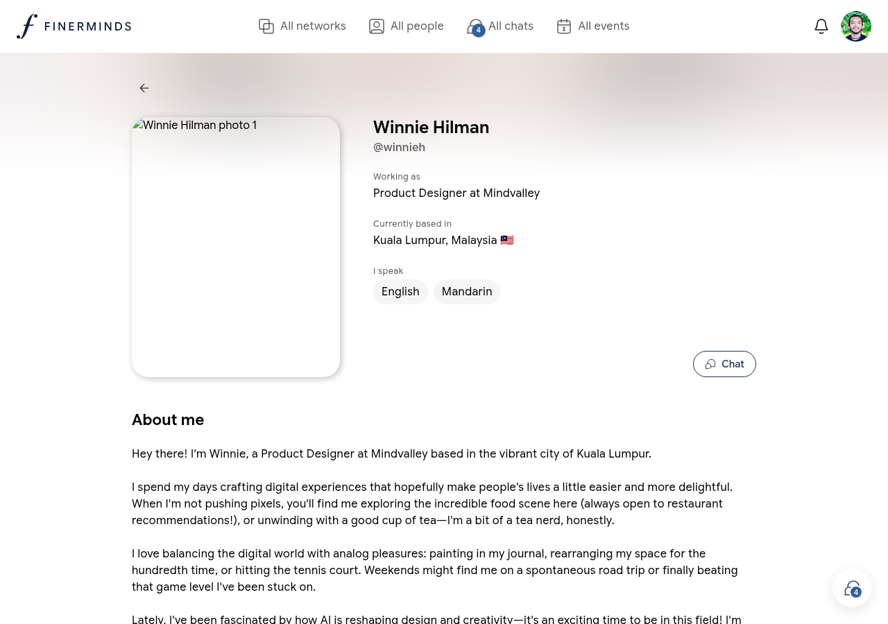

# People

The People directory shows every member of Finerminds. Use it to find colleagues, collaborators, or community members with shared interests.

## Browsing members

Go to **All people** in the sidebar. You will see a grid of member cards showing each person's name, job title, company, and location.

## Filtering

Use the filter bar at the top to narrow the list:

| Filter | What it does |
|--------|-------------|
| **Near me** | Shows members in a similar geographic area |
| **City** | Filter by home city or frequent city |
| **Industry** | Filter by professional industry |
| **Languages** | Filter by spoken language |
| **Interests** | Filter by interest tags from member profiles |

Filters can be combined. Clear any filter by clicking the × on its chip.

## Member profiles

Click any member card to open their profile.

A profile shows:

- Name, avatar, and username
- Job title and company
- Home city and frequent travel locations
- Spoken languages
- About me
- Interests
- Social links (LinkedIn, website, etc.)

## Connecting

To start a conversation with a member, open their profile and click **Message**. This opens a direct message thread in [Chats](chats.md).
