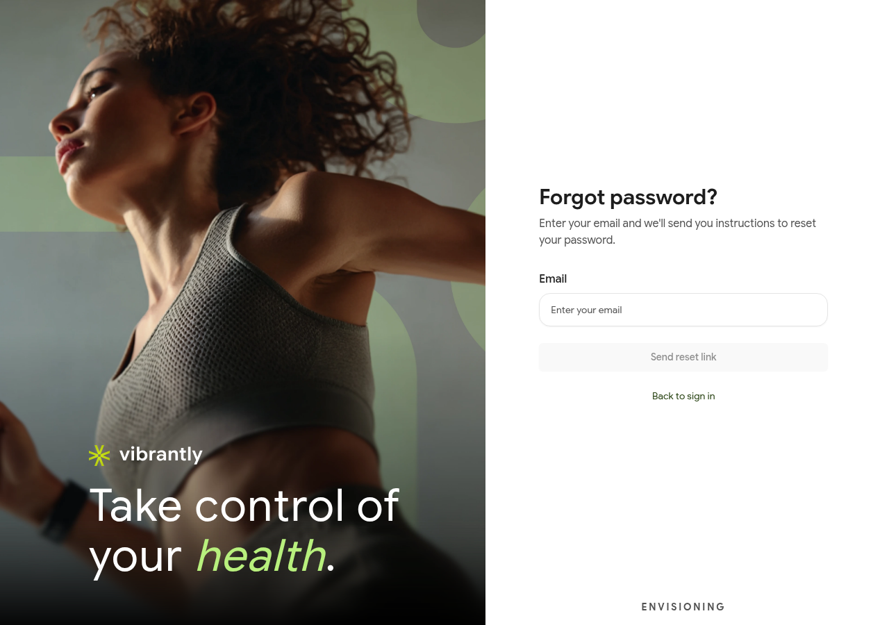

# Password Reset

If you have forgotten your password, you can request a reset link by email.

## How to reset your password

1. Go to the Vibrantly login page and tap **Forgot password?** (below the sign-in form).
2. Enter the **Email address** you used to sign up.
3. Tap **Send reset link**.
4. Check your inbox for an email from Vibrantly with a reset link. Check your spam folder if it does not arrive within a few minutes.
5. Click the link in the email and set a new password.

The reset link expires after 24 hours. If it has expired, repeat the steps above to request a new one.

## If you signed up with Google or Apple

Accounts created with Google or Apple SSO do not have a Vibrantly password. Sign in using the same provider you used at signup — you do not need a reset link.

## Still locked out?

If you no longer have access to your signup email address, contact Vibrantly support to verify your identity and recover your account.
