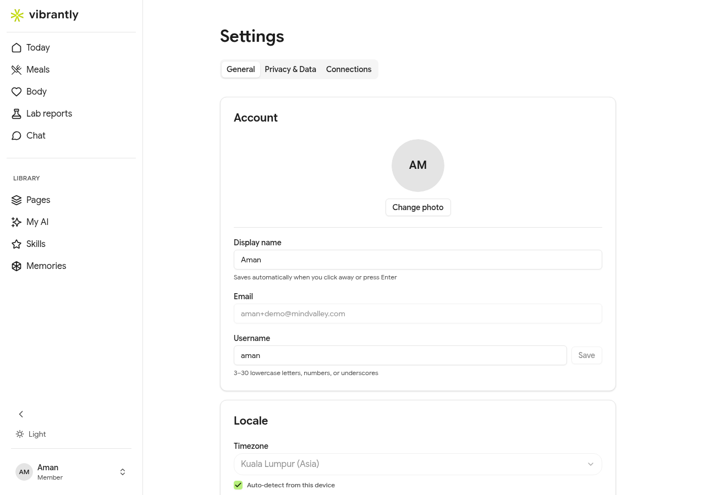

# Profile & Settings

Go to **Settings** from the sidebar to manage your account details and preferences.

## General

| Setting | Notes |
|---------|-------|
| **Display name** | Shown by Luna and throughout the app. Saves automatically when you click away or press Enter. |
| **Email** | Your login email address |
| **Username** | 3–30 lowercase letters, numbers, or underscores |
| **Locale** | Used to format dates and numbers |
| **Timezone** | Defaults to auto-detect from your device. Can be set manually. |
| **Language** | English is available; more languages coming soon |
| **Sign-in method** | Shows your connected sign-in method (email or SSO provider) |

## Privacy & Data

Under the **Privacy & Data** tab:

- Lab report data is encrypted at rest and de-identified before AI analysis runs
- Memories are built automatically from your Chat conversations. Ask Luna to discard a specific memory via Chat.
- Meal logs and lab reports are private to your account
- Pages you create can be set to **Private**, **Private Link**, or **Public**

## Connections

The **Connections** tab shows services linked to your account — including any SSO providers (Google, Apple) you connected at signup.

## Account

The **Account** tab contains actions that affect your account at the account level, including options to close or delete your account. See [Deleting Your Account](deleting-account.md).
