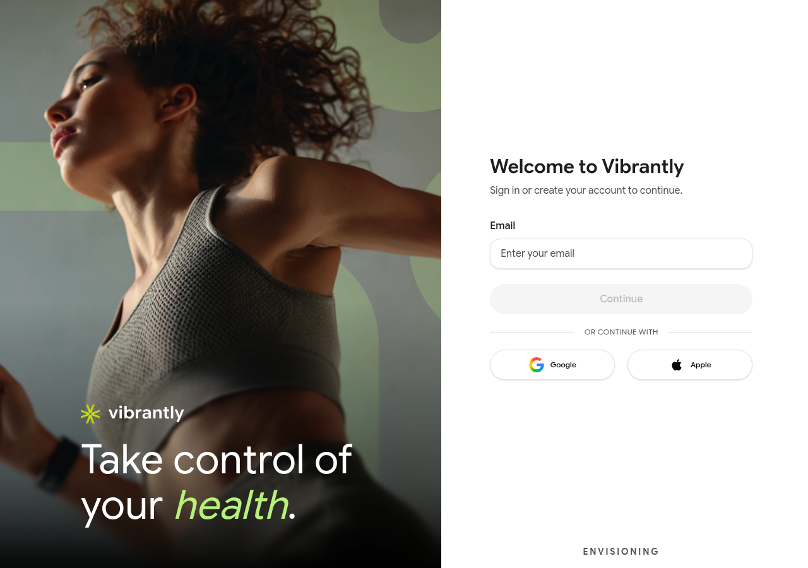

# Signing In

Go to [vibrantly.com](https://vibrantly.com) or open the Vibrantly app to sign in.

## Signing in with email

Vibrantly uses a two-step login — your email and password are entered on separate screens.

1. Enter your **Email address** and tap **Continue**.
2. Enter your **Password** and tap **Sign in**.

## Signing in with Google or Apple

If you created your account with Google or Apple SSO, tap **Continue with Google** or **Continue with Apple** on the login screen. You will be redirected to confirm with that provider and returned to your dashboard.

## Staying signed in

Vibrantly keeps you signed in on trusted devices. If you are signed out unexpectedly, this may be due to a session expiry or a recent password change. Simply sign in again.

## Having trouble?

- Forgot your password → [Password Reset](password-reset.md)
- Account not recognized → check you are using the email address you signed up with
- SSO not working → see [Login Issues](../troubleshooting/login-issues.md)
