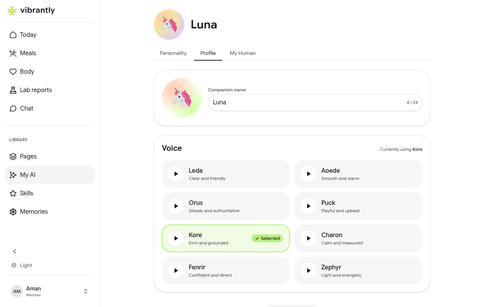

# Companion Settings

Go to **My AI** in the sidebar to customize how Luna behaves and sounds.

## Personality

Choose an **archetype** that sets Luna's overall tone. The default is **Sage** — measured, thoughtful, and question-led.

You can also configure:

| Setting | What it controls |
|---------|----------------|
| **Voice & Style** | Rules for how Luna phrases responses (e.g. "speak in short sentences") |
| **Anti-Patterns** | What Luna avoids (by default: lecturing or prescriptive advice) |
| **Boundaries** | Hardcoded rules that always apply (e.g. never give medical advice) |
| **Custom Instructions** | Specific behaviors that override archetype defaults |
| **Danger Zone** | Reset to archetype defaults — removes all custom entries |

Changes to personality take effect immediately on the next message.

## Profile & Voice

Go to the **Profile** tab within My AI to configure Luna's identity:

- **Companion name** — rename Luna to anything you prefer (up to 24 characters)
- **Voice** — choose from 8 voices for spoken responses

| Voice | Character |
|-------|-----------|
| Leda | Clear and friendly |
| Aoede | Smooth and warm |
| Orus | Steady and authoritative |
| Puck | Playful and upbeat |
| Kore | Firm and grounded |
| Charon | Calm and measured |
| Fenrir | Confident and direct |
| Zephyr | Light and energetic |

Tap any voice to preview it, then tap **Save changes** to apply.
