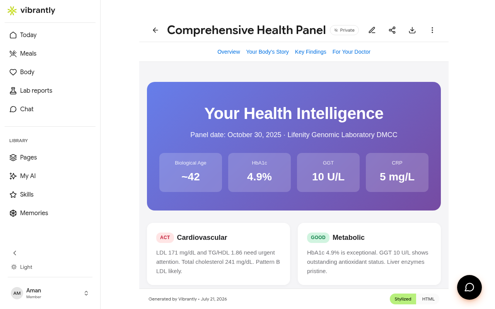

# Lab Reports

Vibrantly reads your bloodwork, extracts biomarker values, and maps them to known reference ranges — explained in plain language.

## Uploading a report

Go to **Lab reports** in the sidebar and either drag-and-drop your file or click **Upload**. Supported formats:

- PDF (most common from labs and clinics)
- CSV (data exports)
- Plain text
- Photos of printed reports

After upload, Vibrantly processes the report using 3 independent AI models that cross-check each other's findings. Processing typically completes in under 60 seconds.

## Report statuses

| Status | Meaning |
|--------|---------|
| **Saved** | Uploaded and stored, analysis pending or not yet triggered |
| **Analyzed** | Fully processed — biomarkers extracted and available in Body |

## Viewing a report's full analysis

Tap **View Results** on any uploaded report to open a full **Your Health Intelligence** page with four tabs:

| Tab | What it shows |
|-----|--------------|
| **Overview** | Key headline metrics (Biological Age, HbA1c, GGT, CRP) and a body-system summary |
| **Your Body's Story** | A narrative interpretation written for a non-clinical reader |
| **Key Findings** | Markers that need attention, with context and recommended actions |
| **For Your Doctor** | A structured summary formatted for sharing with a healthcare provider |

## Sharing a report

Each report page can be kept **Private**, shared via **Private Link** (anyone with the URL), or made **Public**. You can also download or export the raw HTML.

## Privacy

Lab report data is encrypted at rest and de-identified before any AI analysis runs. See [Privacy & Data](../account/profile-settings.md#privacy--data) for details.
