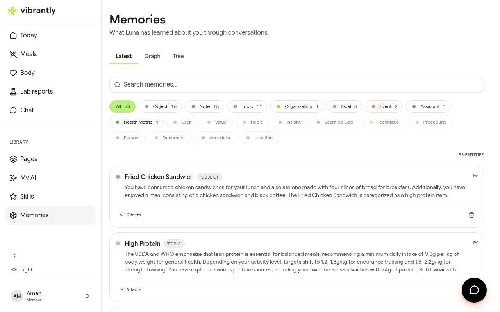

# Memories

**Memories** is Luna's knowledge graph — everything she has learned about you through your conversations.

## What gets stored

Luna builds memories automatically as you chat with her. Memories are organized as:

| Type | Examples |
|------|---------|
| **Objects** | Specific items — meals, products, supplements, plans |
| **Notes** | Observations from your conversations |
| **Topics** | Recurring themes — nutrition, fitness, sleep, stress |
| **Organizations** | Labs, clinics, or services you've mentioned |
| **Goals** | Active health objectives Luna is tracking |

## Viewing memories

Go to **Memories** in the sidebar. You can view your memory graph in three layouts:

- **List** — a flat, searchable list of all memories
- **Graph** — a visual network showing how memories connect
- **Tree** — a hierarchical view grouped by type

## Editing memories

Memories are read-only in the Memories view — Luna builds them automatically. To update or remove a specific memory, ask Luna directly in Chat:

- "Forget that I'm training for a half-marathon"
- "Update my goal — I'm now focused on blood sugar, not weight"
- "I don't take magnesium supplements anymore"

Luna will acknowledge the change and update her knowledge graph accordingly.
