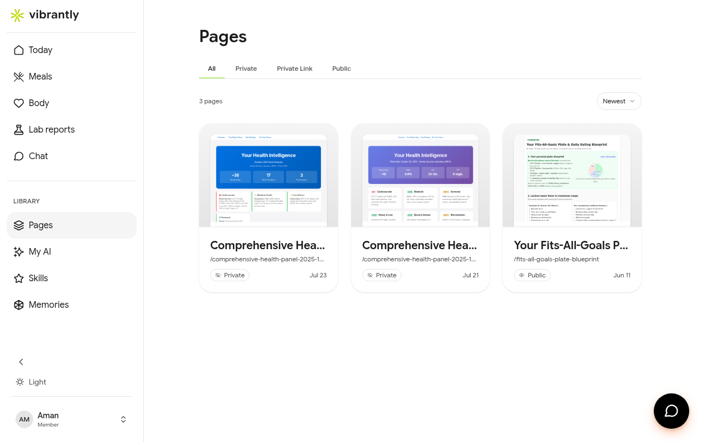

# Pages

**Pages** are AI-generated health documents that Luna creates for you — for example, a plain-English interpretation of a lab report, a personalized nutrition blueprint, or a health summary you can share with a doctor.

## How pages are created

Luna generates a page when you ask for a report or document in Chat. For example:

- "Summarize my latest lab results for my doctor"
- "Create a nutrition plan based on my biomarkers"
- "Write a health summary I can share with my trainer"

Pages are also created automatically when you tap **View Results** on a lab report — Vibrantly generates a **Your Health Intelligence** page for each analyzed report.

## Visibility settings

| Visibility | Access |
|-----------|--------|
| **Private** | Only you |
| **Private Link** | Anyone with the URL |
| **Public** | Discoverable by others |

You can change a page's visibility at any time from the page itself.

## Managing pages

Go to **Pages** in the sidebar to see all your generated documents. From the pages list you can:

- Open and read any page
- Change its visibility
- Download it or export the raw HTML
- Delete it

Pages are separate from your raw uploaded lab report files — deleting a page does not delete the original lab report.
