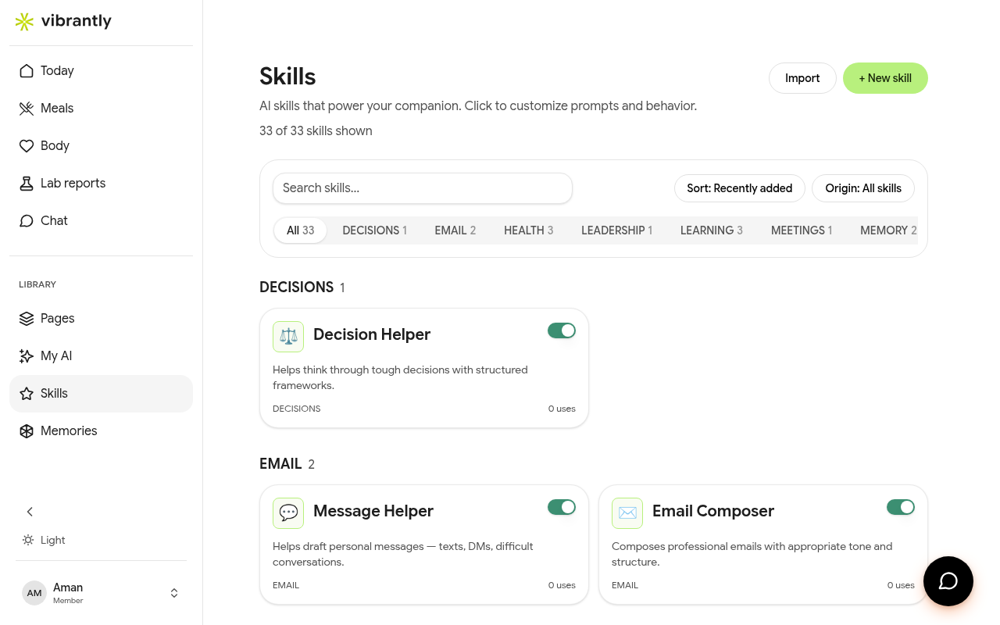

# Skills

**Skills** are specialized AI tools that extend what Luna can do in structured, focused ways.

## Browsing the library

Go to **Skills** in the sidebar to see the full library — 33 skills at launch, organized by category.

| Category | Examples |
|----------|---------|
| **Health** | Menu Analyzer, Food Analyzer, Health Check-in |
| **Planning** | Goal Review, Daily Briefing, Weekly Review |
| **Learning** | Extract Knowledge, Web Reader |
| **Writing** | Note Cleaner, Page Designer, Bio Writer |
| **Review** | Design Review, Page Critic, Watch YouTube |
| **Wellness** | Sleep Coach, Running Plan Builder |

## Using a skill

1. Open **Chat** to start a conversation with Luna
2. Open the Skills panel from within Chat and tap the skill you want to use
3. Luna will activate the skill and guide you through it

Some skills trigger naturally from conversation — if you describe a meal and Luna detects it, she may invoke the Food Analyzer automatically.

## Creating a custom skill

Tap **Create** in the Skills library to build your own skill. Custom skills follow the same format as built-in ones — you define the trigger, the task, and any output format you want.
