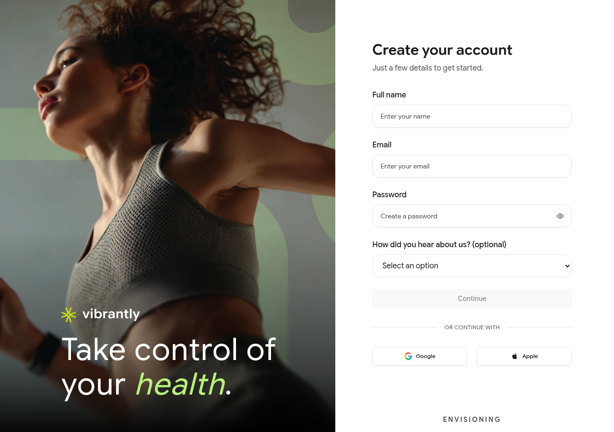

# Creating Your Account

Go to [vibrantly.com](https://vibrantly.com) and tap **Get started** to create a new account.

## Signing up with email

1. Enter your **Full name** and **Email address**.
2. Create a **Password** (minimum 8 characters).
3. Optionally select how you heard about Vibrantly from the dropdown.
4. Click **Continue**.

You will be taken directly into a short onboarding flow to set up your AI companion.

## Signing up with Google or Apple

Below the form, tap **Continue with Google** or **Continue with Apple** to create your account without setting a password. You will be redirected to confirm with Google or Apple, then returned to Vibrantly to complete onboarding.

## Onboarding

After signup, Vibrantly walks you through a short setup:

1. A few health-context questions about your goals and lifestyle
2. Naming your AI companion (default: Luna)
3. Choosing Luna's personality archetype and voice

You can change all companion settings later from **My AI** in the sidebar.

## Already have an account?

Go to [Signing In](../account/signing-in.md) if you already have an account and need help logging in.
