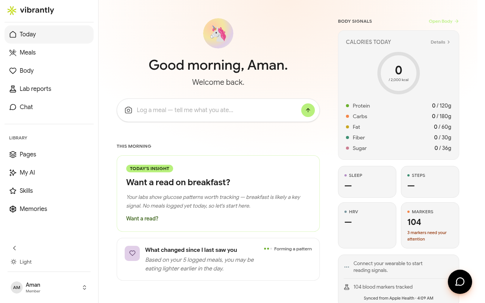

# Understanding the Dashboard

When you log in, Vibrantly opens on the **Today** view — your daily health summary.

## The sidebar

The sidebar is your primary navigation. It is always visible on desktop and accessible from the bottom bar on mobile.

| Section | What it does |
|---------|-------------|
| **Today** | Daily dashboard — meal bar, AI insight, body signals summary |
| **Meals** | Full meal history and logging |
| **Body** | Biomarker view from your uploaded lab reports |
| **Lab reports** | Upload and manage your health files |
| **Chat** | Talk to Luna, your AI companion |
| **Pages** | AI-generated health documents |
| **My AI** | Customize Luna's personality and voice |
| **Skills** | Browse and use specialized AI tools |
| **Memories** | Luna's knowledge graph about you |

## What to do in your first week

1. **Upload a lab report** — this unlocks the Body view and personalizes Luna's responses. See [Uploading Your First Lab Report](first-lab-report.md).
2. **Log a few meals** — open Today and type what you ate in the meal bar at the top of the page.
3. **Chat with Luna** — ask her to explain your lab results in plain English, or to help you build a goal around a specific marker.
4. **Browse Skills** — find specialized tools for your goals (e.g. Food Analyzer, Health Check-in, Running Plan Builder).

## The Today view

The top of the Today view shows Luna's daily greeting and a personalized insight based on your latest data. Below that:

- **Meal bar** — type a quick meal description to log it
- **Today's Insight card** — a pattern Luna noticed in your data
- **From Your Meals** — your most recently logged meals with macro breakdowns
- **Body Signals** — a snapshot of key biomarker flags from your last report
