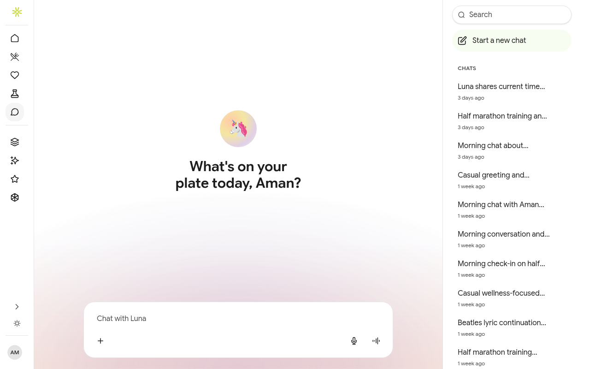
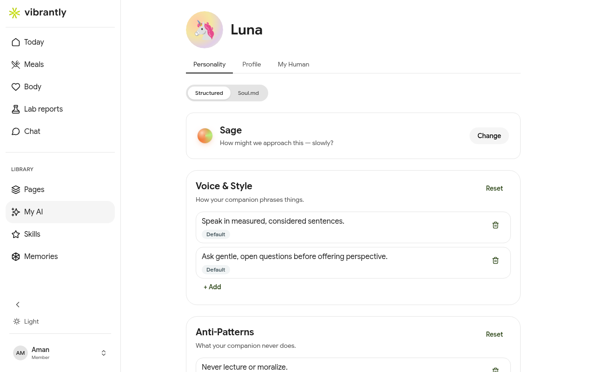

# Your AI Companion — Luna

**Luna** is Vibrantly's built-in AI health companion. She learns from your lab results, meals, and conversations to give you personalized, context-aware health guidance. She is not a general-purpose chatbot — every response is grounded in your actual health data.

## Talking with Luna

Go to **Chat** to start a free-form conversation. Luna can:

- Answer questions about your biomarkers in plain English.
- Help you understand the nutritional impact of what you ate.
- Give coaching check-ins on your health goals (e.g., half-marathon training, blood sugar management).
- Analyze a meal photo or restaurant menu.

Your conversation history is stored and accessible from the sidebar — Luna carries context across sessions.

## Customizing Luna (My AI)

Go to **My AI** to shape how Luna behaves. You can configure:

### Personality
Choose an archetype that determines Luna's tone. The default archetype is **Sage** — measured, thoughtful, and question-led rather than prescriptive.

### Voice & Style
Add or edit rules for how Luna phrases things. Examples:
- "Speak in measured, considered sentences."
- "Ask gentle, open questions before offering perspective."

### Anti-Patterns
Tell Luna what to avoid. By default she will never lecture or give prescriptive advice.

### Boundaries
Hardcoded rules that Luna always honors (e.g., never give medical, legal, or financial advice — she will refer you to a qualified professional).

### Custom Instructions
Add specific behaviors tailored to your preferences that override archetype defaults.

### Danger Zone
**Reset entire personality** reverts all sections to your archetype's defaults and removes your custom entries.

## Skills

**Skills** are specialized AI tools that extend what Luna can do in structured ways. Go to **Skills** to browse the full library (33 skills at launch) or create your own.

Skills are organized by category:

| Category | Examples |
|----------|---------|
| **Health** | Menu Analyzer, Food Analyzer, Health Check-in |
| **Planning** | Goal Review, Daily Briefing, Weekly Review |
| **Learning** | Extract Knowledge, Web Reader |
| **Writing** | Note Cleaner, Page Designer, Bio Writer |
| **Review** | Design Review, Page Critic, Watch YouTube |
| **Wellness** | Sleep Coach, Running Plan Builder |

To use a skill, open Chat and invoke it from the Skills panel, or start a conversation that triggers it naturally.

## Memories

**Memories** is Luna's knowledge graph — everything she has learned about you through your conversations. Go to **Memories** to see and manage it.

Memories are categorized as:
- **Objects** — specific items (meals, products, plans)
- **Notes** — observations from your conversations
- **Topics** — recurring themes (nutrition, fitness, sleep)
- **Organizations** — labs, clinics, or services you've mentioned
- **Goals** — active health objectives Luna is tracking

You can view memories in **List**, **Graph**, or **Tree** view. Memories are read-only — Luna builds them automatically; you cannot manually edit them (but you can ask Luna to update or discard a memory via Chat).
