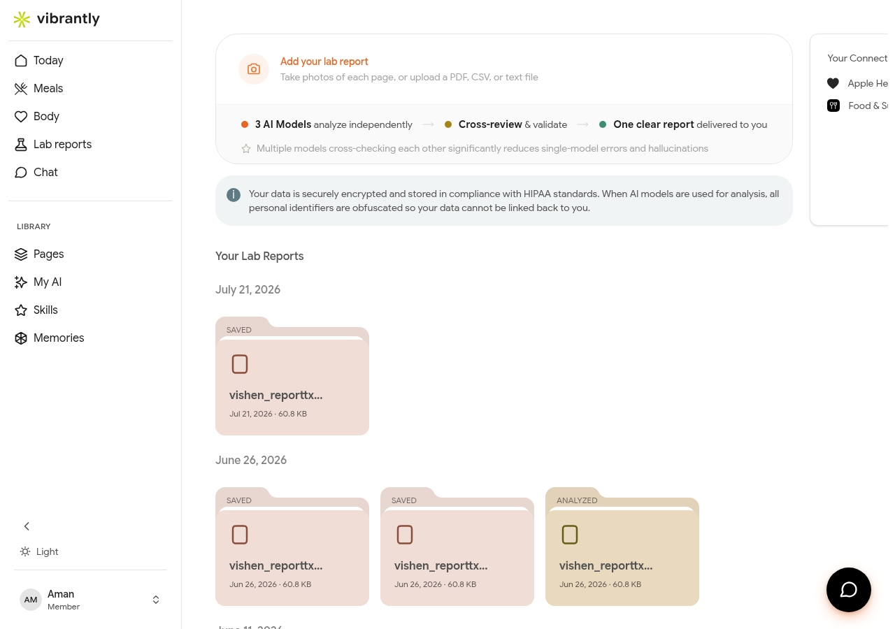

# Apple Health & Wearables

Vibrantly connects to Apple Health and compatible wearable devices to pull in activity, heart rate, sleep, and other signals — giving Luna more data to work with alongside your lab results.

## Connecting Apple Health

Apple Health integration is set up from the **Vibrantly mobile app** (iOS). To connect:

1. Open the Vibrantly app on your iPhone.
2. Go to **Lab reports** or **My Data** from the navigation.
3. Under **Your Connected Apps**, tap **Apple Health**.
4. Approve the permissions Vibrantly requests — you can grant access to specific data types (Activity, Heart Rate, Sleep, Body Measurements, Nutrition).
5. Tap **Allow** to complete the connection.

Once connected, Vibrantly syncs your Apple Health data automatically in the background.

## What data is synced

| Data type | Used for |
|-----------|---------|
| Activity (steps, workouts) | Body signals summary, goal tracking |
| Heart Rate | Body signals |
| Sleep | Body signals summary |
| Body Measurements (weight, BMI) | Biomarker context |
| Nutrition | Cross-referenced with meal logs |

## Viewing connected apps

On desktop or mobile, go to **Lab reports** in the sidebar. The **Your Connected Apps** section shows which integrations are active and their sync status.

## Disconnecting

To disconnect Apple Health, open the Vibrantly app on iOS, go to your Connected Apps, and tap **Disconnect** next to Apple Health. You can also revoke access from the **Health** app in iOS Settings > Privacy & Security > Health > Vibrantly.

## Android and other wearables

Android support and additional wearable integrations (Garmin, Whoop, Oura) are on the Vibrantly roadmap. Check the **My Data** page for the latest list of connected app options.
