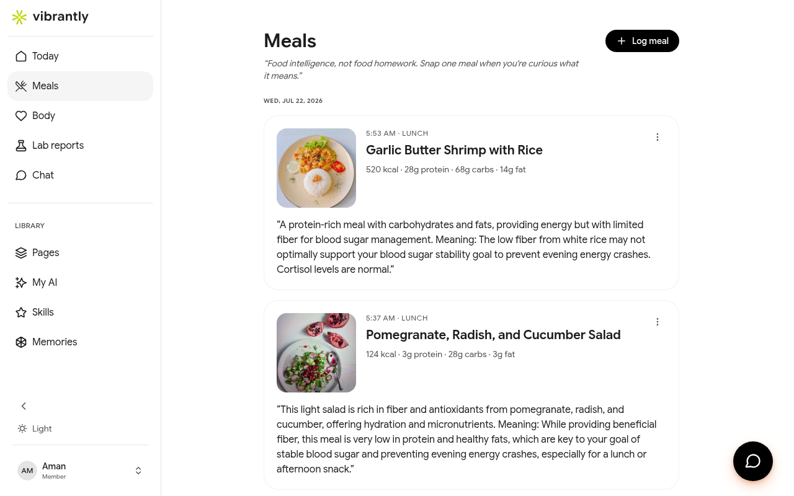
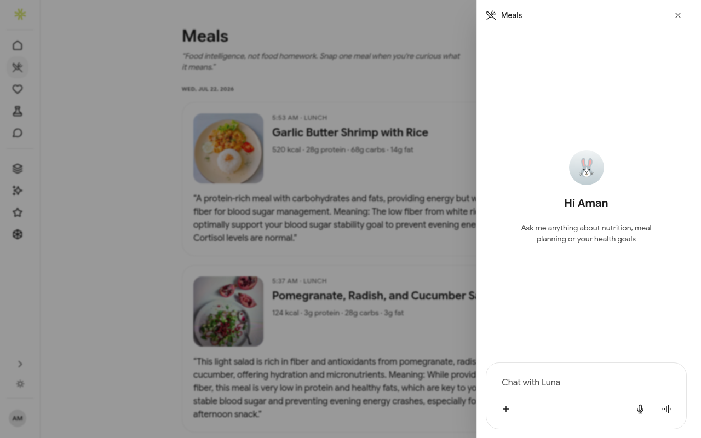

# Meals

Vibrantly treats food as intelligence, not homework. You log what you eat when you're curious what it means — and Luna tells you, in plain English, what it does for your body and your goals.

## Your Meal History

The **Meals** section shows your full log sorted by date, with each entry showing:

- **Meal photo** (if logged via photo or identified by Luna)
- **Time and meal type** — Breakfast, Lunch, Dinner, or Snack
- **Macronutrient breakdown** — calories, protein, carbs, fat
- **Luna's commentary** — what this meal means for your specific health goals and biomarker patterns

Tap **Load older meals** at the bottom to paginate through your full history.

## Logging a Meal

Tap **+ Log meal** to open Luna's meal logging panel. This is a chat interface — describe what you ate in plain text and Luna handles the rest:

1. **Describe your meal** — e.g. "Grilled salmon with roasted vegetables and brown rice"
2. **Luna identifies it** and estimates the full nutritional breakdown (calories, protein, carbs, fat, fiber, sugar)
3. **Luna contextualises it** — explains what the meal means for your active health goals and any flagged biomarkers

You can also:
- **Use the + button** to attach a photo of your meal instead of typing
- **Use the microphone** to describe your meal by voice

Luna carries the full context of your health data into every meal log — so her analysis is always specific to you, not generic nutritional advice.

## What Luna Looks For

When analysing a meal, Luna cross-references:

- **Your health goals** (e.g. stable blood sugar, increasing protein intake)
- **Your latest biomarkers** (e.g. if your glucose patterns are flagged, she'll call out high-GI meals)
- **Your recent meal patterns** (e.g. if you've been eating lighter earlier in the day, she'll note a forming pattern)

This means the same meal (e.g. a chicken sandwich) gets a different analysis depending on your specific profile.

## Meal Types

Luna automatically classifies each logged meal as:

| Type | Typical time |
|------|-------------|
| Breakfast | Morning meal |
| Lunch | Midday meal |
| Dinner | Evening meal |
| Snack | Between-meal item |

You can correct the classification if Luna gets it wrong by mentioning it in the chat (e.g. "That was actually my dinner").
