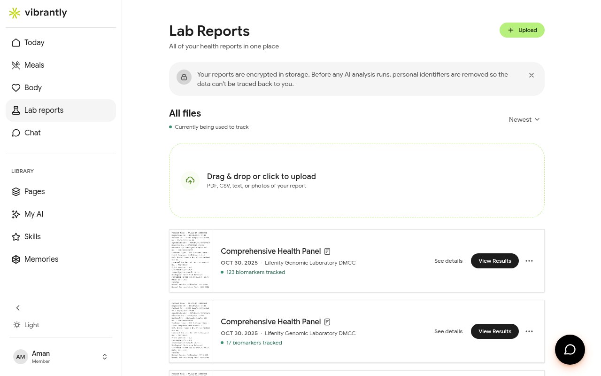
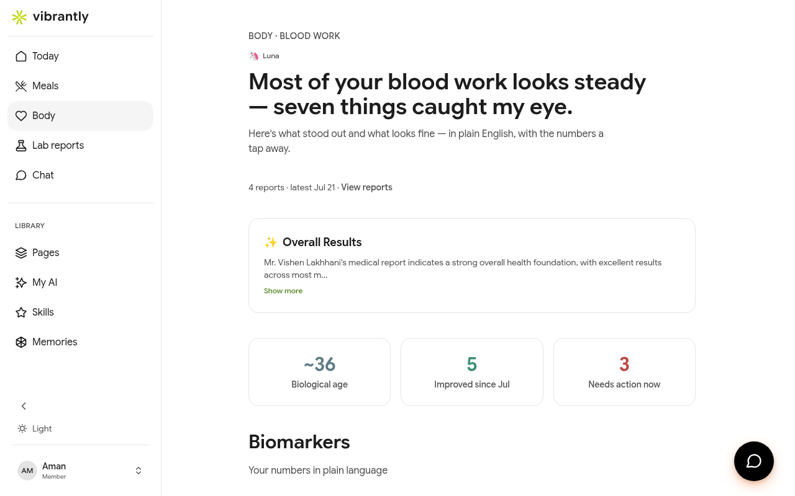

# Body Signals & Lab Reports

Vibrantly tracks your biomarkers from lab reports and surfaces the ones that matter most — explained in plain language, not medical jargon.

## Uploading a Lab Report

Go to **Lab Reports** and either drag-and-drop your file or click **Upload**. Supported formats:

- PDF (most common from labs)
- CSV (data exports)
- Plain text
- Photos of printed reports

Your reports are encrypted at rest. Before any AI analysis runs, personal identifiers are removed from the data.

After upload, Vibrantly reads the report, extracts biomarker values, and maps them to known reference ranges. This may take a few seconds.

## Understanding Your Biomarkers (Body View)

Go to **Body** to see your complete biomarker picture — categorized, annotated, and prioritized by Luna.

At the top, Luna gives you a natural-language summary: what looks strong, what caught her attention, and why.

### Biomarker Status Labels

| Label | Meaning |
|-------|---------|
| **Excellent** | Within the optimal range |
| **Borderline** | On the edge — worth monitoring |
| **Needs attention** | Outside reference range; action likely needed |
| **Missing** | Not found in your uploaded reports |

### Biomarker Categories

Vibrantly groups biomarkers by system:

- **Hormonal** — Cortisol, Testosterone, Thyroid, DHEA, Estradiol, and more
- **Cardiometabolic** — Cholesterol (LDL, HDL), Triglycerides, Blood Sugar, Inflammation markers
- **Liver Function** — ALT, AST, GGT, Bilirubin
- **Kidney Function** — Creatinine, Blood Urea
- **Complete Blood Count** — Red cells, White cells, Hemoglobin, Platelets
- **Vitamins & Minerals** — Vitamin D, B12, Folic Acid, Iron, Zinc, Magnesium
- **Inflammation** — CRP (C-Reactive Protein)
- **Autoimmune** — Anti-CCP, RA Factor
- **Pancreatic Function** — Amylase, Lipase

Use the filter buttons (**All / Excellent / Borderline / Needs attention / Missing**) to focus on what needs your attention.

### Biological Age Estimate

Based on your latest panel, Vibrantly estimates a **biological age** — a composite signal of how your body is performing relative to your chronological age. The number updates each time you upload a new report.

## Connecting Body Signals to Meals

Luna cross-references your biomarkers with your meal history. If, for example, your glucose patterns show variability, she will flag relevant meals in the **Today** view and explain the connection — so you know which food choices are most likely affecting which markers.
