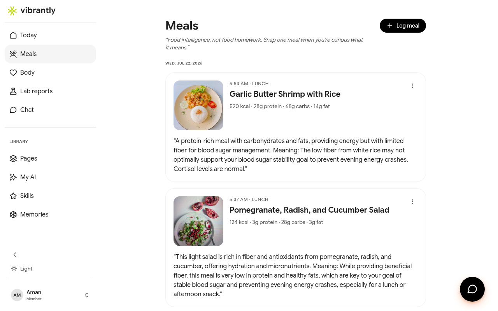

# Today View

The **Today** dashboard is the first thing you see when you open Vibrantly. It brings together your daily meal activity, AI-generated insights, and a summary of your recent body signals.

## Daily Greeting and Insight

At the top of the page, Luna greets you by name and surfaces the most relevant health insight for the day — based on your lab results, recent meals, and your stated goals.

Example insight:
> *"Your labs show glucose patterns worth tracking — breakfast is likely a key signal."*

## Logging a Meal

To log what you ate, tap the **Log a meal** input bar at the top of the page and describe your meal in plain text (e.g., "Fried chicken sandwich and black coffee"). Luna will:

1. Identify the meal and estimate its nutritional breakdown (calories, protein, carbs, fat, fiber).
2. Relate it to your current health goals.
3. Show you what the meal means for your body — not just numbers.

You can also log meals via photo by using the **Food Analyzer** skill in the Chat section.

## Today's Insight Card

Below the meal input, Luna shows a **Today's Insight** card — a concise observation based on patterns in your data. This may highlight:

- A trend across your recent meals (e.g., lower protein intake in the mornings).
- A connection between a biomarker and your eating habits.
- A forming pattern worth watching.

## Meals Summary

The **From Your Meals** section shows your most recent logged meals with:

- Time and meal type (Breakfast / Lunch / Dinner / Snack)
- Macronutrient breakdown (protein, fiber, carbs, fat, calories)
- Luna's interpretation of how the meal fits your goals

Tap **See all** to go to the full [Meals](meals.md) history.

## Body Signals Summary

The bottom of the Today view shows a **Body Signals** summary, including:

- Calories tracked today
- Key biomarker flags surfaced from your latest lab report

This is a snapshot — tap any item to go to the full [Body](body.md) section for your complete biomarker picture.
